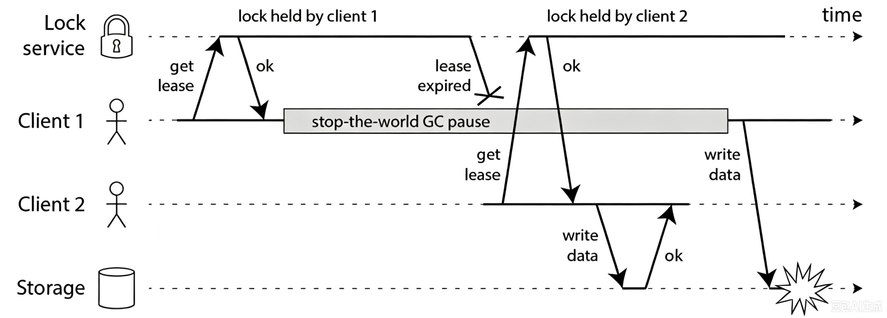
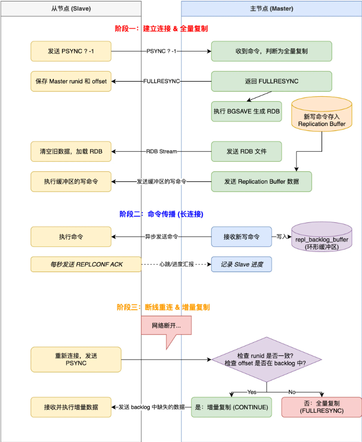
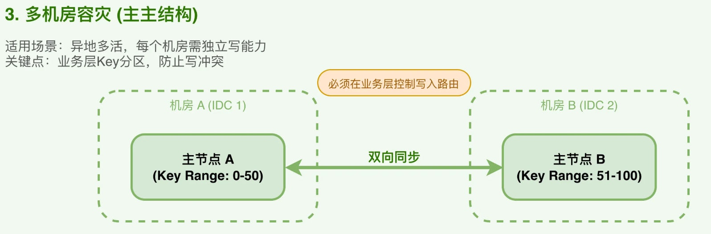

## Redis 是什么

Redis（Remote Dictionary Server） 是一个基于内存的高性能 Key-Value 数据库，支持 String、Hash、List、Set、ZSet 等多种数据结构，并提供持久化、过期策略、主从复制、哨兵、集群等机制，通常用来做缓存、分布式锁、计数器、排行榜、会话存储、消息队列等。

**Redis 在 Java 后端中的常见用途**

- 缓存数据，减少 MySQL 压力。
- 分布式锁。例如秒杀接口，两个服务器同时请求，可以利用 Redis 只让一个请求获得锁，避免并发修改。实际 Spring Boot 项目一般用 Redisson。
- 计数器。Redis 的 `INCR` 是原子操作，非常适合统计浏览量、点赞数、访问次数、限流次数。
- 排行榜。利用 Redis 的 ZSet 来实现。
- Sesison 共享
- 消息队列，Redis 支持 `List`、`Pub/Sub`、`Stream` 都可以实现一定程度的消息通信，不过如果是复杂、可靠性要求高的消息队列场景，一般会使用 RabbitMQ、Kafka、RocketMQ。

## Redis 中常见的数据类型

Redis 常见的数据类型主要有五种：String、Hash、List、Set、ZSet。

1. **String** 最基本的类型，能存文本、数字、二进制、JSON等。比如：缓存用户会话，分布式锁，计数器等 

   ```sql
   SET user:1:name Tom
   GET user:1:name
   
   SET count 10
   INCR count
   ```

2. **Hash** 本质上是个键值对集合，特别适合存对象属性。它和直接用 String 存 JSON 的区别是，Hash 可以单独修改某个字段。

   ```sql
   HSET user:1 name Tom age 20
   HGET user:1 name
   HGETALL user:1
   ```

3. **List** 有序、可重复的字符串列表，底层是双向链表，支持两端操作。

   最常用的场景就是消息队列，LPUSH 生产消息，RPOP 消费消息，简单的生产者消费者模式就搞定了。不过真正复杂的消息队列场景通常更推荐 Redis Stream 或 RabbitMQ、Kafka、RocketMQ。

   ```sql
   LPUSH message a
   LPUSH message b
   
   RPOP message
   ```

4. **Set** 是无序、不重复的集合，查找和去重（支持集合运算，交集、并集、差集）效率很高。适合做标签系统、记录某个页面的独立访客、共同关注等需要去重或集合运算的场景。

   ```sql
   SADD hobbies basketball
   SADD hobbies football
   SADD hobbies basketball
   
   # 集合运算
   SINTER user:1:friends user:2:friends  
   ```

5. **ZSet（Sorted Set）** 有序、不重复，每个元素有 score 分数用来排序，底层用跳表实现。最典型的就是排行榜、延迟队列，比如游戏积分榜、热搜榜，按 score 排序后直接取 Top N。

   ```sql
   ZADD ranking 100 Tom
   ZADD ranking 90 Jack
   ZADD ranking 120 Alice
   
   # 获取排行榜前 10
   ZREVRANGE ranking 0 9 WITHSCORES
   ```

以及几种常用的特殊数据类型。

1. **Bitmap** 用位来存数据，每个 bit 只占 0 或 1，空间利用率极高。比如统计 1000 万用户的签到情况，每个用户只占 1 bit，总共才 1.2 MB。用 SETBIT 设置状态，GETBIT 读取状态。
2. **HyperLogLog** 概率性数据结构，专门用来估算基数。不管塞进去多少数据，固定只占 12 KB 内存，代价是有 0.81% 左右的误差。适合统计网站 UV 这种对精度要求不高但数据量巨大的场景。
3. **GEO** 用来存地理位置，支持经纬度存储和空间查询。底层其实是用 Zset 实现的，经纬度会被编码成 score。典型场景就是“附近的人”、外卖配送距离计算。
4. **Stream** 专门为消息队列设计的数据结构。相比 List 做队列，Stream 多了两个关键特性：自动生成全局唯一消息 ID，支持消费组模式。相比 Pub/Sub 最大的优势是消息可以持久化。消费者挂了重启还能继续消费。

### String

**String 类型的大小限制**

String 最大能存 512 MB，这是源码中写死的。

无论是网络传输、内存分配还是字符串操作，大字符串都会增加 Redis 服务器的负载。且过大的字符串在 GET、SET、APPEND 等操作都会导致性能瓶颈，主从同步也有延迟风险。

所以官方给字符串的大小做了限制，防止单个键值对占用过多的内容，影响整体性能和稳定性。

实际生产中，单个字符串 10 KB 以内是比较合理的，超过 100 KB 就要考虑拆分了。


### ZSet 的原理

Redis 的 ZSet（Sorted Set，有序集合）可以理解成 Set + Score 排序。每个元素不能重复，但每个元素都会绑定一个 `score`：

```
member      score
Tom         100
Jack        80
Mike        120
```

Redis 会按照 `score` 排序，所以最终：

```
Jack   80
Tom    100
Mike   120
```

ZSet 的底层实现主要分两种情况：

```
数据量较小 → listpack
数据量较大 → skiplist（跳表） + hashtable
```

核心重点其实是后面的：跳表 + 哈希表。

**为什么需要跳表？**

如果只用普通链表：`80 → 100 → 120 → 150 → 200`。要找 `score = 150`，只能从头开始，查询复杂度 O(N)。跳表会在普通有序链表上增加多层“快速通道”：

```
Level 3:  80 ---------------------- 200
           |                         |
Level 2:  80 -------- 120 -------- 200
           |           |             |
Level 1:  80 -- 100 -- 120 -- 150 -- 200
```

查找 `150` 时，从最高层开始，快速向右跳，然后发现不能继续向右跳时，下降一层，然后继续向右。平均查询复杂度可以做到 O(log N)，所以 ZSet 的插入、删除、按照 score 查找、排名查询、范围查询等操作都可以高效完成。

**跳表节点存什么？**

跳表中的节点大致可以理解成：

```
ZSetNode {
    member
    score
    level[]
}
```

例如：

```
Mike
score = 100
```

节点除了存：

```
member
score
```

还会保存不同层级的前进指针。Redis 的跳表还会维护 `span`，可以理解成：当前节点到下一个节点之间跨过了多少个元素。例如：

```
A ------> D
  span=3
```

表示从 A 跳到 D 跨过 3 个排名位置。这个 `span` 很重要，因为 Redis 可以利用它快速计算：

```
ZRANK
ZREVRANK
```

也就是某个 member 排第几名。所以 Redis 跳表不只是为了“快速查找”，还特别适合做：排名计算。

**为什么还需要 Hashtable？**

这时候有个问题：既然跳表已经能查找了，为什么还要再加一个 HashTable？因为跳表擅长的是：

```
按照 score 排序
按照 score 范围查询
按照排名查询
```

但是如果我要 `ZSCORE ranking Mike`，也就是 Mike 的 score 是多少？如果只有跳表，就要在有序结构里寻找 Mike。而 HashTable：

```
member → score
```

可以直接获得对应的 score 值，平均复杂度为 O(1)。所以 Redis 大型 ZSet 实际可以理解成同时维护：

```
               ZSet
                 │
        ┌────────┴────────┐
        ↓                 ↓
   Hashtable           SkipList

member → score       按 score 排序
O(1) 查 score        O(logN) 插入/删除
                    范围查询、排名查询
```

两份结构保存的是同一批元素，只是服务于不同查询。这也是 ZSet 设计最关键的一点：HashTable 负责快速定位 member，SkipList 负责排序和范围查询。

**插入一个元素的过程**

例如 `ZADD ranking 100 Mike`，如果当前使用 `skiplist + hashtable`：

第一步，检查 HashTable：`Mike 是否已经存在？`，如果不存在：`插入 HashTable：Mike → 100`，同时插入跳表：`80 → 90 → 100(Mike) → 120`，所以一份逻辑数据实际上同时进入两个结构。

如果执行：`ZADD ranking 150 Mike`，Mike 已经存在，只是修改 score：

```
原来： Mike → 100
现在： Mike → 150
```

HashTable 中更新 score，同时跳表中因为排序位置发生变化，需要把原节点移除并重新插入：

```
原来：80 → 100(Mike) → 120 → 160
修改后：80 → 120 → 150(Mike) → 160
```

**相同 score 怎么排序？**

ZSet 允许不同 member 的 score 相同：

```
Tom   100
Jack  100
Mike  100
```

当 score 相同时，Redis 会根据 member 的字典序进一步排序。所以整体比较逻辑可以简单理解为：

```
先比较 score ?
score 不同 → score 小的排前面
score 相同 → 按 member 字典序排序
```

因此跳表中的顺序始终是确定的。

**小 ZSet 为什么不用跳表？**

如果只有几个元素：

```
A 10
B 20
C 30
```

直接维护跳表 + HashTable 反而有较大的额外内存开销。所以 Redis 对较小的 ZSet 使用紧凑结构：`listpack`，可以理解成连续内存中紧凑存放：`member score member score member score ...`。

优点：节省内存，CPU Cache 友好。

缺点：数据多时插入、删除成本高。

所以数据规模达到一定条件后，会转成：`skiplist + hashtable`。具体转换阈值可以通过 Redis 配置调整，而且不同 Redis 版本配置名称和默认值可能有所变化，因此面试时通常不用背具体数字。

**常见命令复杂度**

可以大致记：

| 操作            | 典型复杂度   |
| --------------- | ------------ |
| `ZSCORE`        | O(1)         |
| `ZADD`          | O(log N)     |
| `ZREM`          | O(log N)     |
| `ZRANK`         | O(log N)     |
| `ZREVRANK`      | O(log N)     |
| 按 score 找范围 | O(log N + M) |

其中 `M` 是返回的元素数量。例如 `ZRANGE ranking 0 9`，获取排行榜前 10 名。或者 `ZRANGEBYSCORE ranking 80 100`，查 score 在 80～100 之间的成员。跳表非常适合这种 `有序 + 范围查询 + 排名查询` 的场景。

## BigKey 问题

> Redis 的 Hash 大 key 怎么优化，以及优化后如何兼容老业务老数据，新业务怎么用优化后的缓存，老缓存删不删

Redis 的 BigKey 指的是：某个 key 对应的 value 过大，或者集合类 key 中元素数量过多。比如：String 类型超过 1 MB；Hash、List、Set、ZSet 元素超过 5000 个，实际生产为了性能要求只会更严格。

BigKey 主要会带来几个问题：

- 阻塞 Redis 主线程：Redis 很多命令在主线程执行，如果一次操作 BigKey 耗时很长，会阻塞其他请求。
- 网络阻塞：例如 `GET` 一个几十 MB 的 String，会产生很大的网络传输。
- 删除阻塞：直接 `DEL` 一个包含几百万元素的 Hash/List/Set，释放内存本身可能很耗时。
- 主从同步压力：BigKey 的写入、修改会增加复制流量。
- 内存分布不均：Redis Cluster 中，如果 BigKey 都落在某一个节点，容易导致节点内存倾斜。
- 迁移困难：Cluster 扩缩容时迁移 BigKey 成本很高。

解决 BigKey 的方法：

核心思想是避免“单个 key 承载过多数据”，并避免对大 key 做一次性全量操作。

1. 拆分 BigKey：把大对象拆成小对象

2. 不要使用全量查询命令

   例如，对于大 Hash，不要使用 `HGETALL key` 一次全部拿出来，改成 `HSCAN key 0 COUNT 100`。

3. 删除 BigKey 使用 `UNLINK`

   不要 `DEL big:key`，因为 `DEL` 删除复杂大对象时，内存释放可能占用主线程较长时间。更适合 `UNLINK big:key`，`UNLINK` 会先把 key 从 keyspace 中摘掉，再由后台线程异步回收对应内存，从而降低主线程阻塞。

4. 控制集合长度

   例如消息列表 `LPUSH messages xxx`，如果永远不删除，队列内容不断增加，最终就会成为 BigKey。可以使用 `LTRIM messages 0 9999` 限制只保留最近 10000 条记录。

5. 提前监控 BigKey

   常用命令 `redis-cli --bigkeys`，可以扫描 Redis 中较大的 key。

## Redis 为什么这么快？

Redis 最大的特点是“快”。因为 MySQL 这类数据库的数据主要存储在磁盘上，而 Redis 的主要数据存储在内存中。内存访问速度远高于磁盘，所以 Redis 很适合放那些“访问频繁、又不希望每次都去查数据库”的数据。

Redis 快的核心原因就三个：纯内存操作、单线程 + IO 多路复用、高效的数据结构。

1. 内存 VS 磁盘

   访问一次内存大概 120 纳秒，访问一次 SSD 要 50-150 微秒，传统机械硬盘更慢，要 1-10 毫秒。内存比磁盘快了将近 1000 倍。Redis 把数据全放在内存中，除了持久化，基本不跟磁盘打交道。

2. 单线程 + IO 多路复用

   Redis 用单线程执行命令，避免了多线程带来的锁竞争、上下文切换、线程同步。网络 IO 用 epoll 等 I/O 多路复用机制，一个线程管理大量 socket 连接，哪个连接有数据就处理哪个，不用等待。

   > 注意：现代 Redis 并不是所有工作都单线程，Redis 6 以后网络 I/O 可以使用多线程，但核心命令执行仍主要采用串行模型。

3. 高效的数据结构

   Redis 的数据结构都是为快而生的。String 底层是 SDS，O(1) 获取长度；Hash 小数据量用 listpack，数据量变大后转为 hashtable 保证 O(1) 查询；List 底层是 quicklist；Set 底层是 intset / hashtable；ZSet 用跳表，插入查询都是 O(logN)。

## 过期策略

> Redis 的过期策略采用惰性删除和定期删除相结合。惰性删除是在访问 key 时检查是否过期，过期则删除；定期删除则周期性抽取部分设置了过期时间的 key，删除其中已经过期的数据。这样可以在 CPU 消耗和内存占用之间取得平衡。

> key 已经过期了，什么时候把它删掉？

Redis 的过期策略主要就两种：惰性删除和定期删除。

Redis 实际上是把两种策略结合起来使用。

1. 惰性删除

   Redis 不会在 key 一过期就立即删除，而是等再次访问该 key 时，才检查它是否过期，过期了的话就顺手删掉，然后返回空。

   优点是不用额外占用 CPU 去检查是否存在过期的 key。

   缺点是如果一个 key 已经过期，但是以后再也没人访问，它就可能继续占用内存。

2. 定期删除

   为了解决惰性删除导致过期 key 长期占内存的问题，Redis 会定期检查一部分设置了过期时间的 key：定期抽取一批设了过期时间的 key 检查，发现过期的就删掉。

   注意，不是每隔一段时间扫描所有 key。因为如果 Redis 有几百万、几千万个 key，全量扫描会消耗大量 CPU。所以 Redis 采用的是定期随机抽查部分带过期时间的 key，并删除其中已经过期的 key。

> 我认为：惰性删除解决了高频访问的过期问题。定时删除解决了低频访问的过期问题。

## 内存淘汰策略

> Redis 在内存达到 `maxmemory` 后，会根据配置的内存淘汰策略删除部分 key。主要包括 `noeviction`、`volatile-*` 和 `allkeys-*` 三类。其中 volatile 只从设置了过期时间的 key 中淘汰，allkeys 从所有 key 中淘汰；具体可以按照 LRU、LFU、随机或者 TTL 等规则选择 key。实际作为缓存使用时，比较常见的是 `allkeys-lru` 或 `allkeys-lfu`。

> Redis 内存达到 `maxmemory` 上限时，但是还有很多 key 没过期，应该删谁？

如果过期策略中的惰性删除和定期删除都没能及时清理，内存还是涨到了 maxmemory 上限，这时候写入新数据会触发内存淘汰机制。

Redis 常见的内存淘汰策略可以分成 3 类。

**不淘汰**

`noeviction` 内存满了以后，不删除任何 key，新的写操作直接报错。适合不允许 Redis 自动删除数据的场景。

**只淘汰设置了过期时间的 key**

`volatile-random` 随机淘汰一个带过期时间的 key

`volatile-ttl` 优先淘汰剩余过期时间最短的 key

`volatile-lru` （lru，最近最少使用，least recently used）淘汰最近最少使用的 key

`volatile-lfu` （lfu，最少使用，least frequently used）淘汰使用频率最低的 key

**针对所有 key 淘汰**

`allkeys-random` 从所有 key 中随机淘汰

`allkeys-lru` 从所有 key 中淘汰最近最少使用的

`allkeys-lfu` 从所有 key 中淘汰访问频率最低的

**上述中 LRU 与 LFU 辨析**：

LRU 关注的这个 key 最近有没有被用过，LFU 关注的是这个 key 总体访问频率高不高。比如：

```
A：昨天访问了 10000 次，但今天没访问
B：今天刚访问 1 次
```

对于 LRU 来说，A 会被淘汰；对于 LFU 来说，B 会被淘汰。

LRU 存在的问题：如果某段时间有大量冷数据被批量扫描，会把真正的热数据挤出去。

LFU 就是为了解决 LRU 的这个问题，它统计访问频率而不是访问时间。但 LFU 也存在问题：如果某个 key 历史上被访问很多次，但现在已经不热了，它还是会一直占着内存。Redis 4.0 引入的 LFU 算法做了优化，访问计数会随时间衰减，不会出现“僵尸热点”的问题。

**实际生产环境选择**

1. 大多数业务场景直接用 allkeys-lru 就行，简单粗暴有效。
2. 如果业务有明确的热点数据，比如电商的爆款商品、社交平台的热门帖子，用 allkeys-lfu 更合适。
3. 如果 Redis 里村的数据分为两类，一类是缓存数据设了过期时间，另一类是持久化数据没设过期时间，那就用 volatile-lru，这样只淘汰缓存数据，持久化数据不会被误删。
4. noeviction 一般用在 Redis 当消息队列的场景，数据丢了可能造成业务异常，宁可写入失败也不能丢数据。

## Redis 的持久化机制 RDB、AOF

> Redis 提供 RDB 和 AOF 两种持久化机制。RDB 会定期生成内存数据快照，文件较小、恢复较快，但可能丢失两次快照之间的数据；AOF 会记录每次写命令，数据安全性更高，但文件较大，恢复速度相对较慢。Redis 还支持将两者结合，即混合持久化策略，通过 RDB 保存基础数据、AOF 保存增量操作，在恢复速度和数据安全性之间取得平衡。

Redis 作为内存数据库，为了防止宕机导致数据全部丢失，提供了把内存中的数据保存到磁盘的机制，使 Redis 重启后能够恢复数据。

Redis 主要提供了 **RDB** 和 **AOF** 两种持久化方式，以及结合两者优势的**混合持久化**。

**RDB（Redis Database）** - 快照持久化

RDB 会在某个时间点，把 Redis 内存中的全部数据生成一份快照文件，默认文件名通常是 dump.rdb。

优点：恢复速度快，文件体积小，适合做备份和灾难恢复，大数据量下的恢复速度通常也比纯 AOF 更快。

缺点：它只保存某个时间点的数据，如果两次快照之间 Redis 宕机，就可能丢失这段时间的数据。生成快照时还需要执行 `fork()`，数据量较大时可能造成短暂延迟和额外内存压力。

**AOF（Append Only File）** - 日志持久化

AOF 不直接定期保存完整数据，而是记录 Redis 执行过的写命令。默认文件通常类似 appendonly.aof。

AOF 的写回策略：

- always 每个写命令执行后都同步到磁盘，数据最安全，但性能最差。每次写操作都要等磁盘。

  设置为 always 不确保一定不丢数据。因为 Redis 是先执行命令再写 AOF，如果命令执行完，AOF 还没写进去 Redis 就挂了，这条命令就丢了。

- everysec（默认推荐）每秒同步一次，最多丢失 1 秒的数据，在性能和安全之间取得了很好的平衡。

- no 由操作系统决定何时同步，性能最好，但 Redis 挂了可能丢比较多数据。

优点：数据丢失更少，数据恢复更加完整。

缺点：文件通常比 RDB 大，写入磁盘的开销更高，恢复时需要重放所有命令。

AOF 重写：AOF 持续记录命令，文件会越来越大。例如：

```sql
SET count 1
SET count 2
SET count 3
SET count 4
```

恢复最终状态其实只需要：

```sql
SET count 4
```

因此 Redis 会执行 AOF 重写，根据当前数据状态生成更精简的 AOF，而不是简单复制旧文件。重写可以通过 `BGREWRITEAOF` 触发。重写过程中 Redis 仍然可以继续接收写操作，完成后再安全切换到新文件。

**混合持久化**

混合持久化结合了 RDB 和 AOF 的优点。在 AOF 重写时，先将当前内存数据以 RDB 的格式写入 AOF 文件的开头，然后将重写期间的增量写命令以 AOF 格式追加到文件末尾。

优点：重启时先快速加载 RDB 部分，再重放少量的 AOF 增量命令，既保证了极快的恢复速度，又实现了极高的数据安全性。

### 生产环境配置持久化

大多数场景用混合持久化，兼顾恢复速度和数据安全。everysec 的 AOF 写回策略够用了，最多丢 1 秒数据。同时配合定时 RDB 备份做异地容灾，比如每天凌晨低峰期做一次全量 RDB 传到 OSS。对数据安全性要求极高的场景才考虑 always，但要评估性能影响。

### 为什么 Redis 不使用 WAL 而是 AOF？

> Redis 并不是完全没有使用类似 WAL 的思想，AOF 本质上也是一种逻辑重做日志。但传统 WAL 主要用于解决磁盘数据页和内存脏页之间的一致性问题，而 Redis 的数据主体在内存中，没有持续原地更新的磁盘数据页。因此 Redis 直接记录写命令，并在重启时重放命令重建内存数据，这种 AOF 机制实现更简单，也不依赖具体的底层数据结构。

Redis 选择记录写命令的 AOF，而不是记录数据页修改的传统 WAL，主要因为 Redis 和磁盘数据库的存储模型不同。

1. WAL 主要解决“内存页和磁盘页不一致”

   以 InnoDB 为例，真正的数据最终保存在磁盘的数据页中。执行更新时，不会立刻把整个数据页刷盘，而是：

   ```
   修改 Buffer Pool 中的数据页
           ↓
   先持久化 redo log
           ↓
   以后再把脏页刷入磁盘
   ```

   这里必须遵守 redo log 先落盘，数据页后落盘。这就是 Write-Ahead Logging。

   假设数据页还没刷盘，数据库就宕机了，可以通过 redo log 重新修改磁盘数据页。但 Redis 不一样，Redis 的主数据在内存，磁盘上没有一套持续原地更新的数据页。Redis 宕机后，整个内存数据都消失了，重启时直接根据持久化文件重新构建内存数据库即可。

   因此 Redis 没有：磁盘数据页，脏页，页刷盘顺序，redo log 与数据页一致性。也就不需要照搬 InnoDB 那种 WAL 机制。

2. AOF 记录命令，更符合 Redis 的模型

   Redis 执行：

   ```sql
   SET name Mike
   INCR count
   HSET user:1 age 20
   ```

   AOF 就记录这些写命令。重启时重新执行：读取 AOF，重新执行写命令，重建内存数据。这比记录底层内存变化简单得多。假设 Redis 使用传统的底层 WAL，就可能需要记录：

   ```
   哈希表哪个桶发生变化
   跳表哪个节点发生变化
   quicklist 哪个节点发生变化
   某段内存修改了哪些字节
   ```

   这样会带来很多问题：

   - 日志与 Redis 底层数据结构强耦合；
   - 内存地址在重启后没有意义；
   - Redis 版本升级或底层编码变化后，旧日志难以重放；
   - 日志生成和恢复逻辑复杂。

   而记录命令：

   ```sql
   ZADD ranking 100 user1
   ```

   不需要关心 ZSet 当前底层使用的是 listpack 还是跳表。重启时 Redis 按当前版本的数据结构重新执行即可。

3. AOF 是逻辑日志，兼容性更好

   传统 WAL 常记录比较底层的物理变化，例如：第 10 个数据页、偏移量 200、修改为某些字节。AOF 记录的是更高层的业务操作：

   ```sql
   SET key value
   SADD users user1
   ZADD ranking 100 user1
   ```

   因此 AOF 有几个明显优点：容易生成、容易重放、容易检查、容易修复、不依赖内存地址、不强依赖底层编码。AOF 使用 Redis 协议格式记录命令，这也使恢复过程可以复用 Redis 本身的命令执行能力。

## 缓存穿透、击穿、雪崩

> 缓存穿透是请求不存在的数据，导致每次请求都访问数据库；缓存击穿是某个热点 key 失效，大量请求同时访问数据库；缓存雪崩是大量 key 同时过期或者 Redis 整体故障，导致大量请求集中进入数据库。对应可以通过缓存空值或布隆过滤器、互斥锁或逻辑过期、随机 TTL 和 Redis 高可用等方式解决。

这三个概念都是缓存失效导致请求打到数据库的场景，区别在于失效的原因和范围不同：

**缓存穿透**

请求查询的数据，在 Redis 和数据库中都不存在。例如不断请求不存在的商品：

```http
GET /product/999999999
```

由于数据库中没有数据，所以无法正常写入缓存。之后相同请求仍然会绕过 Redis，直接访问数据库。大量恶意请求可能导致数据库压力过大。

解决方案：

- 入口校验：参数合法性检查放在最前面，ID 小于 0 直接拒绝，格式不对直接返回。

- 缓存空值：数据库查询不到时，也在 Redis 中缓存一个空值，并设置较短的过期时间，之后相同请求直接从 Redis 返回空结果。缺点是可能产生大量无效 key。

- 布隆过滤器（Bloom Filter）：在查询 Redis 和数据库之前，先判断数据是否可能存在

  ```
  请求
   ↓
  布隆过滤器
   ↓
  确定不存在 → 直接返回
  可能存在   → 查询 Redis
  ```

  布隆过滤器的特点是：如果判断为不存在，那么一定不存在；如果判断为存在，那么可能存在。因此它可以拦截绝大多数非法 key。

**缓存击穿**

某一个访问量特别高的热点 key 突然过期，大量请求同时涌进来，全部访问数据库。比如秒杀商品的缓存刚好过期，几万请求一下子打到数据库，数据库可能瞬间承受很大压力。

解决方案：

- 互斥锁：只有一个线程允许查询数据库和重建缓存，其他线程等待或稍后重试。

- 逻辑过期：key 本身不设置物理过期时间，而是在 value 中保存一个逻辑过期时间：

  ```json
  {
    "data": {
      "id": 1001,
      "name": "商品"
    },
    "expireTime": "2026-07-28 12:00:00"
  }
  ```

  发现逻辑过期后：先返回旧数据，然后后台线程重建缓存。

  这种方案不会让请求直接打到数据库，但短时间内可能返回旧数据。

  > 对于 “key 本身不设置物理过期时间，而是在 value 中保存一个逻辑过期时间” 的解析：
  > 热点 key 不设置物理过期，是为了保证缓存永远命中；保存逻辑过期时间，是为了让系统知道数据什么时候已经陈旧，并触发异步更新。
  >
  > 此处的**物理过期时间**指的是：通过 Redis 的 `EXPIRE` 或 `SET EX` 设置时间，这个是由 Redis 服务器底层提供的功能，过期后会真实删除数据；而逻辑过期时间其实就是 value 中一个用于记录过期时间的字段，过期后，后台异步刷新缓存。

- 热点 key 不设置过期时间：对于极少数长期热点数据，可以不设置过期时间，在数据修改时主动更新或删除缓存。

  > 删除更简单，下次请求回自动重建。更新的话要注意并发问题，可能出现数据库和缓存不一致。另外后台线程也要定期刷新，防止因为某些原因导致缓存一直是旧数据。

**缓存雪崩**

当某一个时刻出现大规模的缓存失效的情况，那么就会导致大量的请求直接打在数据库上面，导致数据库压力巨大，如果在高并发的情况下，可能瞬间就会导致数据库宕机。这时候如果运维马上又重启数据库，马上又会有新的流量把数据库打死，这就是缓存雪崩。

常见原因：

- 大量 key 同时过期：例如系统启动时，给一批商品统一设置 30 分钟过期，30 分钟后大量 key 同时过期，大量请求进入数据库，数据库压力骤增。
- Redis 服务整体挂掉：Redis 宕机，网络故障，Redis 集群异常，连接池耗尽等。

解决方案：

- 对于大量 key 同时过期：

  1）给过期时间增加随机值，采用`基础过期时间 + 随机时间`，这样 key 会分散过期。比如：`30 分钟 + 0～10 分钟随机值`。

- 对于Redis 整体不可用，需要在架构层面解决：

  1）Redis 高可用：主从 + 哨兵，或者 Redis Cluster，挂一个节点不影响整体服务。

  2）本地缓存兜底：用 Caffeine 或 Guava Cache 做一层本地缓存，Redis 挂了还能顶一阵。

  3）服务熔断与降级：用 Sentinel 或 Hystrix 发现数据库压力过大直接熔断，返回默认值或错误提示（如：直接返回“系统拥挤”之类的提示），防止过多的请求打在数据库上。至少能保证一部分用户是可以正常使用，其他用户多刷新几次也能得到结果，从而保住系统不崩。

### Redis 快速实现布隆过滤器

Redis 实现布隆过滤器，本质上就是利用它非常擅长的两件事：**Bitmap 位图存储 + 哈希定位。**

实际有三种做法：

- 直接使用 Redis 的 Bloom Filter
- 利用 Redis Bitmap 自己实现
- 直接用 Redisson 封装好的 `RBloomFilter` （实际项目中使用的方式）

**直接使用 Redis 的 Bloom Filter**

例如 `BF.RESERVE`、`BF.ADD`、`BF.EXISTS`。Redis 官方文档目前提供了完整的 Bloom Filter 命令集。

例如先创建一个容量 100 万、误判率 1% 的过滤器：

```
BF.RESERVE user:bloom 0.01 1000000

其中：
user:bloom  → Bloom Filter 的 key
0.01        → 允许 1% 误判率
1000000     → 预计存储 100 万个元素

添加用户：
BF.ADD user:bloom 10001
BF.ADD user:bloom 10002

判断：BF.EXISTS user:bloom 10001 返回 1 表示可能存在，0 表示一定不存在
```

`BF.INSERT` 还可以在 Filter 不存在时直接创建并添加元素。

**利用 Redis Bitmap 自己实现**

假设：用 `1000000 bit 的 Bitmap + 3 个 hash 函数` 来构建。

```
插入 "user:10001"：
hash1 → 100
hash2 → 500
hash3 → 800
然后：
SETBIT bloom:user 100 1
SETBIT bloom:user 500 1
SETBIT bloom:user 800 1

查询 "user:10001" 时重新算 hash，然后：
GETBIT bloom:user 100
GETBIT bloom:user 500
GETBIT bloom:user 800
判断：三个值全部 = 1 表示可能存在，任意一个 = 0 表示一定不存在
```

**直接用 Redisson 封装好的 `RBloomFilter` （实际项目中使用的方式）**

```java
RBloomFilter<Long> bloomFilter = redissonClient.getBloomFilter("user:bloom");
bloomFilter.tryInit(1_000_000, 0.01);
bloomFilter.add(10001L);
boolean exists = bloomFilter.contains(10001L);
```

你只需要告诉它：

```
预计元素数量：1,000,000
误判率：1%
```

底层的 Bitmap 多大、需要几个 Hash、每个元素映射到哪些 bit，都帮你处理了。

## Redis 中的 Lua 脚本

Redis 的 Lua 脚本，就是把多个 Redis 命令写成一段 Lua 代码，然后交给 Redis 一次性执行。

Lua 脚本的核心特点：

- 原子性：Lua 脚本的所有命令在执行过程中是原子性的，因此把多个 Redis 操作组合成一个原子操作，执行期间不会被其他客户端命令插入，避免了并发修改带来的问题。

  > 注意：Lua 脚本本身不具备原子性，但 Redis 是单线程执行命令的，它把整个 Lua 脚本当成一个命令来跑，执行期间不处理任何其他请求，也就使得执行过程中不会被其他命令打断，好像有了原子性。

- 减少网络往返次数：通过在服务器端执行脚本，减少了客户端和服务器之间的网络往返次数，提高了性能。

- 复杂操作：可以在 Lua 脚本中执行复杂的逻辑，比如批量更新、条件更新等，超过了单个 Redis 命令的能力。

### 为什么需要 Lua 脚本

假设要实现“库存大于 0 才扣减库存”。如果在 Java 中分两步执行：

```
读取库存
↓
判断库存 > 0
↓
扣减库存
```

对应命令：

```
GET stock
DECR stock
```

并发时可能出现问题：

```
线程 A 读取库存：1
线程 B 读取库存：1

线程 A 扣减：库存变成 0
线程 B 扣减：库存变成 -1
```

因为 `GET` 和 `DECR` 虽然各自是原子的，但两个命令组合起来不是原子的。使用 Lua 脚本：

```lua
local stock = tonumber(redis.call('GET', KEYS[1]))

if stock > 0 then
    return redis.call('DECR', KEYS[1])
else
    return -1
end
```

Redis 会把整段脚本作为一个整体执行（读取库存 + 判断库存 + 扣减库存）。执行期间不会有其他命令插入，因此不会超卖。

### 如何执行 Lua 脚本

Redis 使用 `EVAL` 命令执行脚本：

```lua
EVAL "return redis.call('GET', KEYS[1])" 1 stock
```

参数含义：

```
EVAL
脚本内容
key 的数量
KEYS[1]
其他普通参数
```

例如：

```
EVAL "return redis.call('SET', KEYS[1], ARGV[1])" 1 name Mike
```

在脚本中：

```
KEYS[1] -- name
ARGV[1] -- Mike
```

最终相当于：

```
SET name Mike
```

约定上：

```
KEYS：Redis key
ARGV：普通参数
```

不要把 key 直接写死在脚本里，应通过 `KEYS` 传入。

### 常见应用场景

**分布式锁安全解锁**

加锁时保存一个唯一标识：

```sql
SET lock:order uuid123 NX PX 30000
```

释放锁时必须先判断锁是不是自己的，再删除。这两个操作必须原子执行：

```lua
if redis.call('GET', KEYS[1]) == ARGV[1] then
    return redis.call('DEL', KEYS[1])
else
    return 0
end
```

否则可能发生误删其他线程锁的问题。

**库存扣减**

```lua
local stock = tonumber(redis.call('GET', KEYS[1]) or '-1')

if stock <= 0 then
    return 0
end

redis.call('DECR', KEYS[1])
return 1
```

**限流**

例如同一用户一分钟内最多访问 100 次：

```lua
local count = redis.call('INCR', KEYS[1])

if count == 1 then
    redis.call('EXPIRE', KEYS[1], ARGV[1])
end

if count > tonumber(ARGV[2]) then
    return 0
end

return 1
```

脚本保证 `INCR` 和首次设置过期时间的逻辑整体执行。

### EVALSHA

如果每次用 `EVAL` 发送长脚本会占用大量网络带宽。因此 EVALSHA 的作用是为了避免重复传输脚本。

所以整个流程是这样的：

1. 第一次用 `SCRIPT LOAD` 或 `EVAL` 把脚本发给 Redis，Redis 把它缓存起来并返回 SHA1。
2. 之后每次执行，客户端只需要发 `EVALSHA <sha1>` + 参数，Redis 拿着这个 SHA1 去缓存里找到对应的脚本直接执行。

这样做的核心目的就是**省带宽**。一个 Lua 脚本可能几百字节甚至更长，但 SHA1 只有 40 个字符。在高并发场景下，这个优化效果非常明显。

不过有一个细节要注意：`EVALSHA` 如果找不到对应的脚本缓存（比如 Redis 重启了、或者脚本被手动清除了），会返回一个 `NOSCRIPT` 错误。所以实际开发中，客户端一般会做一个**降级处理**：先尝试 `EVALSHA`，如果报 `NOSCRIPT`，就回退到用 `EVAL` 重新发送完整脚本。Redisson 等主流客户端库内部都是这么处理的。

## Redis 中的分布式锁

Redis 分布式锁，就是利用 Redis 让多个进程、多个服务实例在同一时间只能有一个获得某个资源的操作权限。

例如订单服务部署了三台：

```
服务 A ─┐
服务 B ─┼→ 修改订单 1001
服务 C ─┘
```

Java 的 `synchronized` 只能约束同一个 JVM，无法协调不同服务器，因此需要分布式锁。

**加锁基础实现：SET NX EX**

```
1. 客户端执行 SET lock_key uuid EX 30 NX
2. Redis 检查 lock_key 是否存在
3. 不存在则设置成功，返回 OK，加锁成功
4. 已存在则返回 null，加锁失败
```

加锁推荐使用一条原子命令：

```sql
SET lock:order:1001 uuid-123 NX PX 30000
```

参数含义：

```
NX：全称 Not eXists。意思是只有当这个 key 不存在时，才执行设置操作。
PX：设置毫秒级过期时间
30000：锁 30 秒后自动过期
uuid-123：锁持有者的唯一标识
```

执行结果：1）返回 `OK`，加锁成功；2）返回空，锁已经被其他线程占用。

必须在一条 `SET` 命令中同时完成加锁和设置过期时间，不能拆成：

```sql
SETNX lock:key value
EXPIRE lock:key 30
```

因为如果 `SETNX` 成功后服务宕机，`EXPIRE` 没执行，锁就可能永远不释放。（`SETNX` 和 `EXPIRE` 都是 Redis 2.6.12 之前的，分开执行无法保证原子性。后续版本 `SET` 命令支持 `NX`、`EX`、`PX` 参数，一条命令搞定加锁和设置时间。）

> 如果不设置锁的过期时间，假设你的 Spring Boot 应用（线程 A）去 Redis 那里登记了一把锁（`SET lock_key uuid NX`），并且**没有设置过期时间**。线程 A 获得锁后直接宕机了（宕机指的是**业务服务（比如 Spring Boot 应用）宕机，而不是 Redis 服务器宕机**）登记成功后，你的应用还没来得及执行业务逻辑，突然因为服务器断电、OOM 或进程被强杀而宕机了。此时，**Redis 服务器是活得好好的**，它内存里依然存着那把锁。你的应用重启后，新的线程（线程 B）去 Redis 申请锁，Redis 一看：“这个 key 已经存在了”，于是直接拒绝。因为当初没有设置过期时间，Redis 永远不会主动删除这把锁。而原来的线程 A 已经死了，没人能去执行释放锁的代码。结果就是：这把锁变成了“僵尸锁”，你的新线程永远拿不到锁，整个业务彻底卡死。而设置过期时间后，即使服务宕机，Redis 也会自动释放锁。
>
> 如果是 Redis 服务宕机：
>
> - 如果 Redis **没有开启持久化**，重启后内存数据清空，锁自然就没了，大家重新竞争。
> - 如果 Redis **开启了持久化（RDB/AOF）**，重启后会从磁盘恢复数据，那把锁依然会被加载回内存，问题依旧存在。

**释放锁实现：Lua 脚本**

```
1. 客户端执行 Lua 脚本
2. GET lock_key 获取当前值
3. 判断值是否等于自己的 uuid
4. 相等则 DEL lock_key，解锁成功
5. 不相等则返回 0，说明锁不是自己的
```

判断锁值和删除锁必须是原子操作：

```lua
if redis.call('GET', KEYS[1]) == ARGV[1] then
    return redis.call('DEL', KEYS[1])
else
    return 0
end
```

执行逻辑：如果锁值等于当前线程的唯一标识，则删除锁。如果锁值不相等，则不处理。

不能在 Java 中分两次执行：

```java
if (uuid.equals(redis.get(lockKey))) {
    redis.del(lockKey);
}
```

因为 `GET` 和 `DEL` 之间，锁可能已经过期并被其他线程重新获得。

## Redisson

Redisson 是一个基于 Redis 的 Java 客户端。它不仅仅是对 `GET`、`SET` 等 Redis 命令进行封装，而是把 Redis 中的数据和功能封装成 Java 程序员熟悉的对象和接口。官方将其定位为 Redis、Valkey 的 Java 客户端和实时数据平台。例如：

```
Redis 数据结构          Redisson 对象

String            →    RBucket
Hash              →    RMap
List              →    RList
Set               →    RSet
Sorted Set        →    RScoredSortedSet
```

它还提供了一些 Redis 原生并没有直接提供的高级分布式对象：

```
RLock              可重入锁
RFairLock          公平锁
RReadWriteLock     读写锁
RFencedLock        带 fencing token 的锁
RSemaphore         信号量
RCountDownLatch    分布式倒计时器
RAtomicLong        分布式原子变量
RBloomFilter       布隆过滤器
RRateLimiter       限流器        
......
```

**可重入**

同一个线程可以重复获得同一把锁：

```java
lock.lock(); // 第一次，加锁计数为 1
lock.lock(); // 第二次，加锁计数为 2

lock.unlock(); // 计数减为 1，锁还没释放
lock.unlock(); // 计数减为 0，真正释放
```

这可以避免同一个线程中的嵌套方法调用发生死锁：

```java
public void methodA() {
    lock.lock();
    try {
        methodB();
    } finally {
        lock.unlock();
    }
}

public void methodB() {
    lock.lock();
    try {
        // 业务
    } finally {
        lock.unlock();
    }
}
```

### 为什么需要 Redisson

如果直接使用 `RedisTemplate` 实现分布式锁，需要自己处理很多细节：

```
SET NX PX 原子加锁
生成锁的唯一标识
判断锁归属
Lua 脚本安全解锁
锁的自动续期
锁的可重入
等待锁的线程如何唤醒
异常退出后的锁释放
```

Redisson 已经封装了这些逻辑。例如自己使用 Redis 命令加锁：

```sql
SET lock:order:1 uuid NX PX 30000
```

解锁还要执行 Lua 脚本：

```lua
if redis.call('GET', KEYS[1]) == ARGV[1] then
    return redis.call('DEL', KEYS[1])
else
    return 0
end
```

使用 Redisson 后，可以直接按照 Java `Lock` 的方式操作：

```java
RLock lock = redissonClient.getLock("lock:order:1");

lock.lock();

try {
    // 执行业务
} finally {
    lock.unlock();
}
```

Redisson 的 `RLock` 实现了 Java 的 `Lock` 接口，并支持分布式可重入锁；等待锁的客户端可以通过 Redis Pub/Sub 接收锁释放通知。

### Redisson 的核心特点

**Java 风格的 API**

Redisson 尽量使用 Java 程序员熟悉的接口，例如分布式 Map：

```java
RMap<String, User> userMap =
        redissonClient.getMap("users");

userMap.put("1001", user);

User result = userMap.get("1001");
```

从 Java 代码来看，它很像：

```java
Map<String, User>
```

但数据实际存储在 Redis 中，因此不同服务实例可以共享这份数据。Redisson 官方提供了数十种基于 Redis 或 Valkey 的分布式对象和服务。

**支持同步和异步编程**

Redisson 提供多种客户端接口：

```
RedissonClient           同步接口
RedissonReactiveClient   Reactor 响应式接口
RedissonRxClient         RxJava 接口
```

例如同步调用：

```java
RBucket<String> bucket =
        redissonClient.getBucket("name");

bucket.set("Mike");
```

异步调用：

```java
RFuture<Void> future = bucket.setAsync("Mike");
```

Redisson 的底层客户端基于 Netty，并提供同步、异步和响应式调用方式。

**支持多种 Redis 部署方式**

Redisson 可以连接多种 Redis 部署结构，例如：

```
单机模式
主从模式
哨兵模式
Redis Cluster
复制模式
代理模式
```

因此应用从 Redis 单机迁移到 Sentinel 或 Cluster 时，可以继续使用 Redisson 的上层 API。

### Redisson 与 RedisTemplate 的区别

| 对比项       | RedisTemplate       | Redisson               |
| ------------ | ------------------- | ---------------------- |
| 定位         | Redis 命令操作工具  | 分布式对象和服务框架   |
| API 风格     | 操作 Redis 数据类型 | Java 集合、并发工具    |
| 普通缓存     | 适合                | 也支持                 |
| 分布式锁     | 通常需要自行封装    | 直接使用 `RLock`       |
| 自动续期     | 需要自行实现        | 提供看门狗机制         |
| 可重入锁     | 需要自行实现        | 原生支持               |
| 分布式限流器 | 需要自行实现        | 提供 `RRateLimiter`    |
| 分布式集合   | 封装程度较低        | 提供 `RMap`、`RSet` 等 |

### 看门狗（Wachdog）机制

> Redisson 的看门狗机制用于解决业务执行时间超过锁过期时间的问题。当获取锁时没有显式指定 `leaseTime`，Redisson 会给锁设置一个默认过期时间，并在后台周期性续期。只要持锁客户端仍正常运行且锁没有释放，就会持续延长锁的 TTL；业务完成并解锁后停止续期。如果客户端宕机，看门狗无法继续续期，锁会在 TTL 到期后由 Redis 自动删除。

Redisson 的看门狗（Watchdog）机制，本质上是一个**分布式锁的“自动续命”系统**。它完美解决了分布式锁中“过期时间难以精确预估”的核心痛点。

在实际的后端系统设计中，锁的过期时间往往面临两难：设得太短，业务没跑完锁就失效了，引发并发问题；设得太长，一旦持锁节点宕机，锁长时间不释放，又会导致死锁。 看门狗机制正是为了打破这个僵局而生的。

**看门狗机制的工作流程**

使用 Redisson 获取锁时，如果没有指定固定的 `leaseTime`：

```java
RLock lock = redissonClient.getLock("lock:order:1001");

lock.lock();

try {
    processOrder();
} finally {
    lock.unlock();
}
```

Redisson 会：

```
获取锁
  ↓
给锁设置初始过期时间
  ↓
启动后台续期任务
  ↓
持锁线程还在持有锁？
 ├─ 是：重新延长锁的过期时间
 └─ 否：停止续期
```

默认的看门狗超时时间是 30 秒，可以通过 `lockWatchdogTimeout` 修改。只要持锁的 Redisson 实例仍然正常运行并且锁没有释放，Redisson 就会周期性延长该锁的过期时间。因此，业务即使执行 1 分钟，只要续期正常，锁也不会在第 30 秒自动失效。

**看门狗机制的触发条件**

关键在于是否指定了 `leaseTime`。

- 没有指定 leaseTime → 开启看门狗续期

  `lock.lock();` 或 `lock.tryLock(3, TimeUnit.SECONDS);` 这里的 3 秒表示最多等待 3 秒获取锁，不是锁的持有时间。获取成功后，Redisson 使用看门狗自动续期，直到主动 unlock。

- 指定了 leaseTime → 固定时间自动释放，不开启看门狗

  `lock.tryLock(3, 30, TimeUnit.SECONDS);` 含义是最多等待 3 秒，锁最多持有 30 秒。由于已经明确指定锁在 30 秒后释放，因此不会使用看门狗自动续期；时间到后锁会自动释放，即使业务仍然没有执行完成。

## RedLock

RedLock 是 Redis 作者 Antirez 提出的一种分布式锁算法，其核心目的是解决在 Redis 集群或多主节点环境下，由于主从异步复制导致锁丢失的一致性与高可用问题。

示例：客户端 A 在 Redis 主节点加锁成功，主节点把锁还没同步到从节点，主节点就宕机了。从节点晋升为主节点后，锁数据还没有同步过来，这时候客户端 B 来加锁，也能获取到锁。两个进程同时拿到锁，数据就乱了。也就是说，现在客户端 A 和 B 都认为自己已经获取了锁，拥有了对临界资源的访问权。从而导致了并发访问，让锁的功能失效了。其实这个锁就是一个协议，需要各个并发来遵守先获取锁，再访问临界资源的协议。如果哪个并发不遵守该协议，锁也没有办法控制。

而 RedLock 的思路是用多个独立 Redis 实例投票，只有拿到大多数节点的锁才算加锁成功。即使部分节点故障，锁的安全性依然有保障。

> 其实这个解决思路就像是一种补丁，让客户端再竞争多数的锁，如果拿到超过半数的锁且没有超时，那么就让该客户端获取对临界资源访问的锁。

**部署方式**

经典 RedLock 使用 5 个相互独立的 Redis 实例，注意是完全独立的，不需要主从复制，不需要哨兵，也不是 Redis Cluster，5 个实例之间没有任何数据同步。

**加锁流程**

1）客户端记录当前时间戳 t1；

2）依次向 5 个节点发送加锁请求，并设置一个较短的超时时间。例如：`SET lock:order:1 uuid NX PX 30000`；

3）客户端获取当前时间戳 t2，计算加锁总耗时；

4）判断是否在至少 3 个节点上加锁成功，整个加锁耗时是否小于锁的有效时间；

- 两个条件都满足，加锁成功；
- 否则，加锁失败，向所有节点发送解锁命令（包括那些客户端认为没有加锁成功的节点）；

**解锁流程**

客户端遍历所有节点，通过 Lua 脚本仅删除 value 与自己唯一标识（如 UUID）匹配的锁，防止误删别人的锁。

**RedLock 不是绝对安全的**

RedLock 依然依赖一些假设：网络延迟不能无限大，客户端不能暂停过久，节点时钟偏差需要受控，业务必须在锁有效期内完成。例如下图所示的情况：



客户端 1 获取锁后发生长时间 Full GC，进程被暂停。GC 期间锁过期了，客户端 2 拿到新的锁。GC 结束，客户端 1 不知道锁已经过期了，继续执行业务。两个客户端同时操作临界资源。

所以 RedLock 不能解决“旧锁持有者恢复后继续执行”的问题。强一致场景还需要使用：

```
fencing token
数据库唯一约束
乐观锁 version
幂等控制
业务状态校验
```

除了 GC，时钟跳变也是隐患。Redlock 依赖各节点的系统时间来计算锁的有效期，如果某个节点的时钟突然往前跳了，锁就会提前过期。

**生产环境的选择**

Redlock 的实现成本不低：

1）需要部署至少 5 个独立实例，资源开销大；

2）加锁要依次访问多个节点，延迟比单机高；

3）极端情况还是有问题。

所以大多数业务场景还是用主从+哨兵的方案，配合 Redisson 的看门狗续期。只有对锁的可靠性要求极高的场景才考虑 Redlock，比如金融交易、库存扣减。

如果确实需要强一致性的分布式锁，可以考虑 ZooKeeper 或者 etcd，它们基于 Paxos/Raft 共识算法，一致性保证比 Redis 更强。

## Redis 中如何保证缓存与数据库的数据一致性

Redis 缓存和数据库的一致性，本质上是一个问题：同一份数据同时存在数据库和 Redis 两个地方，更新时怎么避免一个新、一个旧。

常见的策略有 6 种，前三种问题比较大，后三种才是实际可用的：

1）先更新缓存，再更新数据库；

2）先更新数据库，再更新缓存；

3）先删缓存，再更新数据库。

以上三种在并发场景下都容易出现数据不一致，不推荐。

4）先更新数据库，再删缓存（也叫 Cache Aside，旁路缓存）：实时性要求高的场景首选，极端情况下会短暂不一致，但概率很低；

> 如果数据库更新成功，缓存删除失败怎么办？
>
> 此时数据库是新数据，而缓存是旧数据。常见解决方案就是把 key 发到消息队列，由消费者异步重试删除，直到成功为止。也可以本地重试，比如 Spring Retry，设置重试 3 次，每次间隔 100ms。极端情况下还是失败，就报警人工介入。
>
> 为什么说会出现短暂不一致的概率很低？
>
> 要出问题要满足三个条件同时发生：缓存刚好过期、有并发读写请求、写操作在读操作的“查库”和“写缓存”之间完成。写数据库通常需要几十毫秒，写缓存只需要几毫秒，写操作要在这几毫秒的窗口内完成，概率非常低。而且即使出现了，下次缓存过期后也会自动修复。

5）缓存双删：先删缓存，再更新数据库，等待一段时间，再次删除缓存，能解决“先删缓存再更新数据库”的并发问题；

6）Binlog 异步更新：用 Canal、Debezium 等监听 MySQL Binlog，MySQL 数据库更新后，Canal / Debezium 通过消息队列异步更新或删除缓存。最大的好处是数据库是唯一真实数据源，缓存更新不再强依赖业务代码。而且消息队列有重试机制，能保证最终一致性。

对于涉及金融的业务，需要保证强一致性，那么通常使用分布式读写锁。读操作加锁，写操作加锁，读读不互斥，读写互斥，写写互斥。代价是性能下降明显，写操作会阻塞所有读操作，高并发场景不适合。

**Redis 基本的读写流程**

读流程：

- 先查 Redis，如果命中则直接返回。
- 如果未命中，则查询数据库，将结果写入 Redis（并设置合理的过期时间 TTL），最后返回数据。

写流程：

- 先更新数据库，保证底层数据源是最新的。
- 再删除 Redis 中对应的缓存 Key（注意是删除，不是更新）。

**为什么是删除缓存，而不是更新缓存？**

因为更新缓存容易产生并发覆盖。例如：

```
线程 A：数据库更新成 100
线程 B：数据库更新成 200
```

可能出现：

```
A 更新数据库 100
B 更新数据库 200
B 更新 Redis 200
A 更新 Redis 100
```

最终：

```
数据库 = 200
Redis = 100
```

数据不一致。而删除缓存后，下次查询缓存未命中，就会重新查询数据库，然后将最新数据写入缓存。因此一般遵循更新数据库，删除缓存，而不是同时更新数据库和缓存。

**为什么要“先更新数据库，再删缓存”，而不是“先删缓存，再更新数据库”？**

假设先删缓存：

```
线程 A：删除缓存
        ↓
线程 B：查询缓存，发现没有
        ↓
线程 B：查询数据库，拿到旧值 10
        ↓
线程 A：数据库更新成 20
        ↓
线程 B：把旧值 10 写入 Redis
```

最终：

```
数据库 = 20
Redis = 10
```

而且这个旧缓存可能一直存在到 TTL 到期。所以先删缓存，再更新数据库风险比较大。推荐先更新数据库，再删除缓存。虽然它也不是 100% 没问题，但出现不一致的窗口更小。例如：

```
线程 A：查询数据库得到旧值 10
线程 B：数据库更新成 20
线程 B：删除缓存
线程 A：把旧值 10 写入缓存
```

理论上仍然可能产生旧缓存。但是这个场景要求 `数据库查询+网络返回+写 Redis` 恰好跨越另一个线程的“更新数据库 + 删除缓存”，发生概率通常比“先删缓存”低很多。

## Redis 的哨兵机制

传统的“主从复制”架构存在一个致命缺陷：一旦主节点（Master）宕机，系统无法自动恢复，必须人工介入。而哨兵机制正是为了解决这个痛点而生的，它通过**自动化监控**和**自动故障转移**，确保在主节点发生故障时，系统能快速恢复服务。

所以说 Redis 哨兵（Sentinel）机制的核心作用是：给 Redis 主从架构提供自动故障发现、故障转移和高可用能力。

具体来说，哨兵机制主要承担以下三大核心功能：

1）持续监控（Monitoring）：哨兵本身是独立的进程，它们会以每秒一次的频率，向所有被监控的主节点、从节点以及其他哨兵节点发送 `PING` 命令，通过检测是否能收到有效的 `PONG` 响应，来判断目标节点的健康状态。

2）自动故障转移（Automatic Failover）：这是哨兵最核心的价值。当主节点真的发生故障时，哨兵集群会自动完成选择一个从节点作为主节点和并将该节点切换为主节点，全程无需人工干预。

3）通知提供者（Configuration Provider）：哨兵集群充当了客户端的“服务发现中心”。客户端不需要硬编码主节点的 IP，而是向哨兵询问当前谁是主节点。当故障转移发生后，哨兵会通知客户端最新的主节点地址，客户端据此重新连接，实现无缝切换。

如果一个哨兵节点发现主节点挂了，为了防止预判，还需多个哨兵节点共同认为这件事情。

如果主节点确实挂了，这些哨兵节点会选出一个作为leader，由这个哨兵节点负责从剩下的从节点中选一个出来，作为主节点。选出新的主节点之后，哨兵节点就会控制该节点执行slaveof no one，并且通知其他从节点，修改slaveof到新的主节点之上。哨兵节点会自动通知客户端程序，告知新的主节点是谁，并且此后客户端再进行写操作时，就会访问新的主节点了。

**主从切换的具体流程**

1）主观下线（Subjectively Down，SDOWN）：哨兵节点通过心跳包进制，判读 redis 主节点服务器是否正常工作，如果某个哨兵没有收到响应，该哨兵节点就会认为该主节点下线了。

2）客观下线（Objectively Down，ODOWN）：该哨兵会询问其他哨兵，当多个哨兵节点（通常设置为半数以上）都认为主节点挂了之后，此时这个主节点就是主观下线了。

3）选举哨兵 Leader：为了避免多个哨兵同时操作导致混乱，哨兵集群会基于 **Raft 算法**的变种，从多个哨兵节点中选举出一个 leader 节点，由这个 leader 节点负责从剩下的节点中选出一个作为主节点。

4）选取新的主节点：leader 挑选完毕后，此时需要从剩下的从节点中选一个当作新的主节点。

- 首先会看这些从节点的优先级，每个 redis 数据节点自己的配置文件中有一个优先级（值越小优先级越高，0 表示永不参选）的设置。leader 会选择优先级高的作为新的主节点。 
- 如果数据节点的优先级都一样，那么就比较这些节点的 offset，offset 表示从节点与原来主节点进行数据同步的进度，offset 越大，说明这个节点与原来主节点的数据越新，此时就会选择这个节点作为新的主节点。 
- 如果前面两个条件都一样，此时其实意味着从这些节点中任选一个都行。那么再看这些节点的 runid（一串数字），每个 redis 节点启动时都会生成一个随机的 runid，此时比较 runid 的大小。让 runid 更小的作为新的主节点。 

5）选好新的主节点之后，哨兵 leader 就会：

- 此时 leader 向选中的从节点发送 `REPLICAOF NO ONE`（或 `SLAVEOF NO ONE`）命令，使其脱离从属关系，正式成为新主节点。
- 向其他所有从节点发送 `REPLICAOF <新主IP> <新主端口>` 命令，让它们改为复制新主节点。、

6）通知客户端：哨兵通过 Redis 的发布/订阅机制，向 `+switch-master` 频道广播新主节点的地址信息。客户端（即连接 redis 的进程，如 Spring Boot 中的 `JedisSentinelPool`）订阅该频道后，会自动感知并重新连接到新主节点。

7）旧主处理：哨兵会持续监控旧主节点。当它修复并重新上线时，哨兵会自动向其发送 `REPLICAOF` 命令，将其降级为新主节点的从节点，自动同步数据。

**Raft 算法的流程**

[Raft 算法详解：Leader 选举、日志复制、安全性与成员变更 | JavaGuide](https://javaguide.cn/distributed-system/protocol/raft-algorithm.html)

1）第一个发现主节点主观下线的哨兵成为候选者，先投自己一票；

> 为什么不把第一个发现主节点主观下线的哨兵直接作为 leader？
>
> 原因有如下两点：
>
> - 避免假故障。哨兵判断节点下线，依赖的是心跳超时。在网络环境中，超时可能由多种原因引起：网络短暂拥塞或丢包；目标节点刚好在忙，没来得及回复；哨兵自身负载过高，处理不过来等。所以 Raft 算法要求必须先通过投票，让**超过半数**的哨兵都确认主节点确实不可用（即“客观下线”），才能进入选举阶段。这本质上是一个**分布式共识**的过程，用多数派的判断来过滤掉单个节点的误判。
> - 需要选取一个稳定可靠的哨兵。即使主节点真的挂了，第一个发现它的哨兵也不一定适合当 Leader。因为 Leader 需要承担后续所有故障转移的协调工作，它自身必须是稳定可靠的。Raft 的选举机制通过“随机超时 + 投票”来确保选出的 Leader 是当前集群中状态最好、被最多节点认可的。如果直接指定第一个发现者，万一它自己网络也不稳定，或者马上就要挂了，那故障转移还没完成就可能再次中断。

2）然后向其他哨兵拉票：”投我一票“；

3）每个哨兵手里只有一票，谁先来就投谁，投完就不能改投；

4）候选者拿到半数以上的票就当选 leader。

如果同时有两个哨兵发起选举，可能出现平票。这时候会等一个随机时间后重新选举，所以哨兵节点要配成奇数，减少平票概率。

## Redis 主从复制

Redis 主从复制，就是让一个 Master 的数据自动同步到一个或多个 Replica，从而实现数据冗余（主从复制实现了数据的热备份，是持久化之外的一种数据冗余方式）、故障恢复（当主节点出现问题时，可以由从节点提供服务，实现快速的故障恢复）、负载均衡、读写分离（主库写，从库读），并为 Sentinel 的故障转移提供基础。

### 同步过程

**第一阶段：建立与全量同步**

当从节点第一次连上主节点时，会发送 PSYNC 命令。判断是否需要全量同步，但一般因为是第一次，主节点会执行一次全量复制。具体就是主节点会在后台生成一份 RDB 快照文件发给从节点，从节点拿到后先清空自己的旧数据，然后加载这份快照。

> 在生成和发送快照的这段时间，主节点是不会停止服务的，它会把这段时间新收到的写命令，先暂存在一个叫 `Replication Buffer` 的内存缓冲区中。等快照发完了，再把这个缓冲区里的命令发给从节点，这样就保证了数据不丢失。

**第二阶段：命令传播**

全量同步完成后，主从之间就会建立一个长连接。以后主节点每收到一个写命令，就会异步地发送给从节点，从节点跟着执行就好了。这期间它们会互相发送心跳包（Ping/Ack）来确认对方还活着。这就是正常阶段的复制命令流。

**第三阶段：断线重连与增量同步**

网络总是不稳定的，如果从节点掉线了一会儿又连上了，如果 redis 有几十 GB 数据，那么重新进行一次全量同步代价太高了。所以 Redis 支持增量同步。核心依赖：

- `Replication ID` 

  每个 Master 都有一个复制 ID，可以把它理解成：这条复制历史的身份证。例如：

  ```
  Master replication ID：abc123...
  ```

  Replica 会记住：我之前复制的是哪个 Master 的哪条历史。

  Redis 使用 `replication ID + offset` 标识某个精确的数据集版本。

- `Replication Offset` 

  Master 每向复制流中写入数据，offset 就会不断增加。例如：

  ```
  Master：
  
  offset = 1000
            ↓
  发送一些命令
            ↓
  offset = 1200
  ```

  Replica 也记录：我已经同步到了 offset = 1100。

  所以网络断开重连后，Replica 可以告诉 Master：

  ```
  我的 replication ID = abc123
  我的 offset = 1100
  ```

  也就是：“我之前同步到了 1100，从 1101 开始把缺的数据给我就行。”

  `PSYNC` 本身携带的就是 replication ID 和 offset。

- `Replication Backlog` 

  Master 还维护一个环形缓冲区：`Replication Backlog`，里面保存最近一段时间发送过的复制数据。例如：

  ```
  Master 当前 offset = 1500
  Backlog 保存：
  1000 ~ 1500
  ```

  Replica 重连时说：`我同步到了 1200`。Master 检查：`1201 ~ 1500` 还在 backlog 里。那么直接：`发送 1201 ~ 1500` 的数据，就完成增量同步。

  ```
  Replica 断线
  offset = 1200
  
  Master 继续：
  1201
  1202
  ...
  1500
  
  Replica 重连
      ↓
  PSYNC abc123 1200
      ↓
  Master 查看 backlog
      ↓
  缺的数据还在
      ↓
  只发送 1201~1500
  ```

  这就是部分重同步。但如果 Replica 断线太久：

  ```
  Master 当前 offset = 10000
  
  Backlog 只能保存：
  8000 ~ 10000
  
  Replica：
  offset = 5000
  ```

  那么 `5001 ~ 7999` 已经被 backlog 覆盖掉了。这时没办法增量补齐，只能重新全量同步。

  Redis 官方明确说明：如果所需数据已经不在 replication backlog 中，或者 Replica 所引用的复制历史已经不可识别，就会退化为全量同步。



### 常见拓扑结构

Redis 主从复制常见的拓扑结构主要有 3 种：

- 一主一从

  最简单的结构：

  ```
  Master
    ↓
  Replica
  ```

  Master 负责写，Replica 同步 Master 的数据。

  特点：

  - 结构简单
  - 可以做数据备份
  - Replica 可以承担部分读请求
  - Master 宕机后，可以手动或通过 Sentinel 将 Replica 提升为 Master

  适合规模较小的场景。

- 一主多从

  生产环境更常见，一个主节点挂多个从节点。写操作全走主节点，读操作分散到各个从节点，实现读写分离。主节点挂了的话，从节点可以顶上来。

  ```
             Master（负责写入）
          /     |     \  复制
   Replica1 Replica2 Replica3
   （只读）   （只读） （只读）
  ```

  所有 Replica 都直接从 Master 复制数据。适用场景：适用于缓存读多写少的业务。

  优点：

  - 可以把读请求分散到多个 Replica，实现读写分离
  - 数据冗余更多
  - Sentinel 故障转移时有多个 Replica 可以选择

  缺点：当 Replica 太多时，Master 压力会增加。尤其全量同步时，每个 Replica 都可能让 Master：生成 RDB + 传输大量数据 + 维护复制连接。主节点很容易成为网络瓶颈，所以并不是 Replica 越多越好。

- 树状/级联复制（解决主节点瓶颈）

  为了减轻 Master 的复制压力，可以让 Replica 再作为其他 Replica 的上游：

  ```
               Master
              /      \
         Replica1   Replica2
          /    \
   Replica3   Replica4
  ```

  也可以形成链式：

  ```
  Master
    ↓
  Replica1
    ↓
  Replica2
    ↓
  Replica3
  ```

  这里 Replica3 并不是直接从 Master 复制，而是从 Replica1 复制。

  优点是：减少 Master 直接维护的复制连接数量和网络传输压力。

  例如原来 Master 要给 6 个 Replica 发送复制数据。改成：

  ```
             Master           主节点
            /      \
       Replica1   Replica2    一级从节点
       /   \       /   \
      R3   R4     R5   R6     二级从节点
  ```

  Master 只需要直接维护两个 Replica。

  但缺点也比较明显：复制链路变长，下游 Replica 数据延迟可能更大。而且如果中间节点 Replica1 宕机，那么 Replica3 和 Replica4 的复制也会受到影响。

  适用场景：从节点超过 10 个，避免主节点网卡 / CPU 过载。

- 主主结构（很少用，了解即可）

  两个主节点互相同步，写操作可以打到任意一个主节点上。但 redis 原生不支持主主复制，实际生产环境很少使用，除非有特殊的多活场景配合业务层面的冲突规避。

  

### 延迟排查


## Redis Cluster

Redis 解决的是单机内存和并发的瓶颈问题，它通过多个 Redis 实例组成，每个实例存储不同的数据分片。

> 即，一台 Redis 内存和吞吐量不够了，怎么让多台 Master 一起存数据、一起扛流量？

### 实现原理

**分片**

Redis 把整个 key 空间划分成 `0 ~ 16383`，一共 16384 个 Hash Slot。然后把这些 Slot 分配给不同 Master。比如有 3 个 Master：

```
Master A：0 ~ 5460
Master B：5461 ~ 10922
Master C：10923 ~ 16383
```

官方规定，key 到 Slot 的基本计算方式是 `slot = CRC16(key) mod 16384`，例如：

```
SET user:1001 Mike
            ↓
redis 客户端计算 CRC16("user:1001") % 16384
            ↓
假设得到 8000
```

那么，8000 ∈ Master B，这个 key 就存到 Master B。

> 那么为什么是对 16384 取余，而不是对节点数取余。
>
> 对节点数取余确实可以实现分片，但是问题在于后续的扩容。
>
> 如果按照节点数取余，原先是 `hash(key) % 3`，现在增加一个节点，计算方式为 `hash(key) % 4`，那么原先大量的 key 就需要重新计算，然后将数据迁移到新的计算所得的片中。
>
> 而按照 16384 取余，增加一个节点，分片的计算方式依旧不变，只需要将一部分数据直接移动到新的片区即可。

**客户端怎么知道访问哪个 Master？**

假设根据 `user:1001` 计算得到 `slot = 8000`，属于 Master B。但是客户端误把请求发送给 Master A，A 不会帮你代理到 B。它会返回一个重定向：

```
MOVED 8000 192.168.1.12:6379
```

意思就是 slot 8000 不归我管，你去 192.168.1.12。然后客户端又把请求发给 Master B。所以流程是：

```
Client → Master A
           ↓
        MOVED
           ↓
Client → Master B
```

成熟的 Redis Cluster 客户端，例如 Lettuce、Redisson，会缓存 `Slot → Redis Node` 的映射。所以正常情况下：计算 slot，查询本地 slot 映射，直接请求正确节点。不需要每次都经历 MOVED。Redis Cluster 节点本身不代理请求，而是使用 `MOVED`、`ASK` 等重定向机制让客户端访问正确节点。

**Cluster 节点之间如何通信？**

Redis Cluster 中没有 Sentinel。因为 Cluster 自己就有节点发现，故障检测，故障转移，集群状态维护。Cluster 中所有节点之间会通过 Cluster Bus 进行通信，并采用 Gossip 协议传播集群信息。例如：

```
Master A ←→ Master B
    ↕           ↕
Master C ←→ Replica...
```

节点之间会传播：“谁是 Master”，“谁是 Replica”，“谁负责哪些 Slot”，“哪个节点可能挂了 Cluster 当前状态”等信息。这样只需要很短的时间，集群的所有节点就能达成一致，知道整个集群的拓扑结构。

**Cluster 怎样保证高可用？**

生产环境不会只有：Master A、Master B 和 Master C 这几个主节点。而是通常会给每个 Master 配一个 Replica：

```
Master A        Master B        Master C
   ↓               ↓               ↓
Replica A       Replica B       Replica C
```

这就是常说的 3 主 3 从。比如：

```
Master A → slots 0~5460
Master B → slots 5461~10922
Master C → slots 10923~16383
```

如果 Master B 挂了，就把 Replica B 提升为新 Master。最终：

```
Master A    New Master B    Master C
   ↓                             ↓
Replica A                    Replica C
```

新 Master B 继续负责原 Master B 的 Slot：`5461 ~ 10922`。所以 Cluster 同时具备：数据分片 + 主动复制 + 自动故障转移。

**cluster 如何判断节点挂了？**

这个概念和 Sentinel 的 SDOWN 和 ODOWN 很像，但名称不同。

Cluster 中主要有 PFAIL 和 FAIL。

`PFAIL（Possible Fail）` 表示某个节点自己认为另一个节点可能挂了。类似 Sentinel 的 SDOWN。例如：

```
Master A：
“我已经很久联系不上 Master B”
       ↓
      PFAIL
```

然后这个信息通过 Gossip 传播。当足够多的 Master 都认为 B 出问题：

```
Master A：B 挂了
Master C：B 挂了
Master D：B 挂了
```

达到多数派后：

```
PFAIL
 ↓
FAIL
```

Redis Cluster 官方定义中，`FAIL` 需要多数 Master 对故障形成确认。然后 B 的 Replica 就可以参与故障转移。所以可以和 Sentinel 对照记：

```
Sentinel：
SDOWN → ODOWN

Cluster：
PFAIL → FAIL
```

**从节点如何成为主节点？**

假设 Master B 有两个从节点 Replica B1 和 Replica B2。现在 Master B 节点挂了，Replica 会根据复制情况等条件判断自己是否有资格发起故障转移。然后向其他 Master 请求投票，获得多数派支持，则成为新 Master。之后原 Master B 的 Slot 全部由 B1 接管。

Redis Cluster 使用 `configEpoch` 等机制传播新的 Slot 所属关系。这一点和 Sentinel 有一个很明显的区别。

Sentinel：

```
Sentinel 负责监控
↓
Sentinel Leader 选择 Replica
↓
Replica 升 Master
```

Cluster：

```
Redis 节点自己监控
↓
Replica 自己发起故障转移
↓
其他 Master 投票
↓
Replica 升 Master
```

所以 Redis Cluster 不需要再额外部署 Sentinel。

## 脑裂问题

Redis Cluster 和 Redis Sentinel 都可能会发生脑裂问题。

因此，可以说只要 Redis 存在“主从复制 + 主节点故障转移”，就可能出现脑裂。

| 架构            | 谁负责故障检测和切换 | 是否可能脑裂     |
| --------------- | -------------------- | ---------------- |
| Redis 单机      | 无故障转移           | 基本不存在       |
| 普通主从        | 人工切换             | 人工误切时也可能 |
| 主从 + Sentinel | Sentinel             | 可能             |
| Redis Cluster   | Cluster 节点自身     | 可能             |

### 主从 + Sentinel 脑裂

假设原来的架构是：

```
                Master A
               /        \
         Replica B    Replica C

        Sentinel1 Sentinel2 Sentinel3
```

正常情况下：

```
Client
  ↓
Master A
  ↓
异步复制
  ↓
B、C
```

现在发生网络分区（分布式系统中的核心概念，指的是**本互相连通的分布式集群，因为网络故障，被切分成了两个或多个互相无法通信的"孤岛"**）：

```
网络区域 1                   网络区域 2

Master A                    Replica B
Client X                    Replica C
Sentinel1                   Sentinel2
                            Sentinel3
```

Master A 本身其实没宕机，只是和 B、C、Sentinel2、Sentinel3 失去了联系。这时会发生两件事。

第一，Sentinel 多数派认为 A 挂了：

```
Sentinel2：A 不可达
Sentinel3：A 不可达
        ↓
达到 quorum
        ↓
A 被判定 ODOWN
```

然后 Sentinel 完成故障转移，Replica B 被提升为新的 Master B。于是变成：

```
网络区域 1                   网络区域 2

Master A                    New Master B
Client X                        ↓
Sentinel1                   Replica C  
                            Sentinel2
                            Sentinel3
```

但问题在于：左边的旧 Master A 并不知道自己已经被“罢免”。如果 Client X 还能连接 A，A 仍然可能继续接受：

```
SET order:1 paid
INCR stock
```

于是形成：

```
网络区域 1                网络区域 2

旧 Master A              新 Master B
    ↓                         ↓
Client X                   Client Y

都在接受写请求
```

这就是 Sentinel 架构下的脑裂。Redis 官方明确描述了这种情况：客户端如果和旧 Master 被隔离在同一个网络分区里，仍可能向旧 Master 写入。

假设网络分区前 `stock = 10`，之后：

```
旧 Master A：stock = 9
新 Master B：stock = 8
```

网络恢复后，Sentinel 会认为 B 才是当前合法 Master：

```
A 恢复连接
   ↓
Sentinel 发现 A 是旧 Master
   ↓
让 A 执行 REPLICAOF B
   ↓
A 降级成 Replica
   ↓
重新同步 B
```

那么 A 上：`stock = 9`。这部分脑裂期间产生的数据可能被覆盖、丢失。

Sentinel 官方对此的描述很直接：系统最终会收敛到最新的 Sentinel 配置，而旧 Master 会成为新 Master 的 Replica，因此旧 Master 在网络分区期间接受的写入可能永久丢失。

**那么 Sentinel 怎么降低脑裂影响？**

一个非常重要的配置是：

```
min-replicas-to-write 2 - 主节点必须至少有 N 个从节点确认才能执行写操作
min-replicas-max-lag 10 - 从节点最大延迟秒数，超过这个值就不算有效从节点
```

意思大致是 Master 必须至少有 2 个延迟不超过 10 秒的 Replica 时才接受写入。发生脑裂时，被隔离的主节点因为没有足够的从节点，就会拒绝写入。

Redis 官方也推荐通过这两个参数来限制 Sentinel 网络分区情况下旧 Master 可以继续接受写请求的时间。

但注意：这只能降低风险，不能彻底消除。因为 Redis 主从复制本质还是异步复制。

### Cluster 脑裂

Cluster 的情况和 Sentinel 很像，但 Cluster 没有 Sentinel。假设一个 3 主 3 从集群：

```
Master A        Master B        Master C
   ↓               ↓               ↓
Replica A1      Replica B1      Replica C1
```

其中 `Master B` 负责一部分 Slot：`5461 ~ 10922`。现在发生网络分区：

```
少数派                       多数派

Master B                  Master A
Client X                  Master C
                          Replica B1
                          ...
```

B 本身没挂，只是和集群的大多数 Master 断开。刚发生网络分区时：

```
Client X
   ↓
Master B
```

B 可能暂时仍接受写请求。与此同时，多数派一侧发现长期联系不上 B：

```
B → PFAIL
     ↓
多数 Master 确认
     ↓
B → FAIL
```

然后 B 的 Replica B1 发起故障转移，并从其他 Master 获得多数票成为 New Master B1，并接管原来 B 的 Slot：`5461 ~ 10922`。这时候就出现：

```
少数派                     多数派

旧 Master B               新 Master B1
    ↓                          ↓
Client X                    Client Y

短时间都可能认为自己负责同一批 Slot
```

这就是 Cluster 下的脑裂窗口。Redis Cluster 官方规范也明确描述：客户端如果和旧 Master 一起处于少数派分区中，在故障转移完成前，仍可能向旧 Master 写入。

但 Cluster 相比 Sentinel 有一个非常重要的内置保护：`cluster-node-timeout`。旧 Master B 如果在 `NODE_TIMEOUT` 时间内一直无法联系大多数 Master，就会进入错误状态，然后停止接收请求。所以 Cluster 的脑裂通常有一个明确的最大窗口：

```
网络分区发生
    ↓
NODE_TIMEOUT 以内
    ↓
旧 Master 可能继续接受写
    ↓
超过 NODE_TIMEOUT
    ↓
少数派 Master 停止提供服务
```

Redis 官方说明，少数派中的 Master 在无法联系多数 Master 达到 `NODE_TIMEOUT` 后会停止接受写入，因此网络分区导致的数据分叉窗口是有限的。

假设 `cluster-node-timeout = 15 秒`，那么可能出现：

```
0 秒：网络分区
0~15 秒：旧 Master B 可能继续接受 Client X 的写
15 秒以后：B 无法联系多数派 → 停止接受请求
```

与此同时，多数派中，Replica B1 被提升为新 Master。网络恢复以后：旧 Master B 发现 B1 已经接管 Slot，降级成 Replica，然后去同步 B1（即新 Master）。

于是旧 B 在脑裂窗口中收到、但没有同步给 B1 的数据，就可能丢失。Redis Cluster 官方明确指出，其复制是异步的，因此网络分区和故障转移期间存在已确认写入丢失的窗口。

### 两者对比

| 对比                   | 主从 + Sentinel            | Redis Cluster                       |
| ---------------------- | -------------------------- | ----------------------------------- |
| 谁检测故障             | Sentinel                   | Redis Cluster 节点                  |
| 谁决定切换             | Sentinel Leader            | Master 投票给 Replica               |
| 谁提升 Replica         | Sentinel                   | Replica 自己发起                    |
| 旧 Master 为什么还活着 | 网络隔离，不是真的宕机     | 网络隔离，不是真的宕机              |
| 为什么出现双 Master    | Sentinel 提升了新 Master   | Cluster 提升了新 Master             |
| 如何限制旧 Master      | `min-replicas-to-write` 等 | `cluster-node-timeout` + 多数派检测 |
| 最终结果               | 旧 Master 降级             | 旧 Master 降级                      |
| 是否可能丢数据         | 是                         | 是                                  |
| 根本原因               | 异步复制 + 网络分区        | 异步复制 + 网络分区                 |

### Cluster 与 Sentinel 的区别

Sentinel 只管故障转移，Cluster 既管故障转移有关数据分片。

Sentinel 是哨兵模式，专门盯着主从复制架构里的主节点。主节点挂了，哨兵会把某个从节点提升为新主节点，保证服务不中断。但数据还是全量存在每个节点上，没法水平拓展。

Cluster 是官方的集群方案，把数据自动打散到多个节点上存储，每个节点只存一部分数据。同时 Cluster 内置了类似哨兵的故障检测和自动故障处理机制，某个主节点挂了，它的从节点会自动顶上，不需要额外部署哨兵。

选型建议：

1）数据量不大，单机能抗住，只是想要高可用。用主从+Sentinel，架构简单，运维成本低。

2）数据量大，单机内存不够用，或者写入压力太大需要分散，用 Cluster。能水平扩展，加节点就能扩容。

| 对比项            | Sentinel                     | Redis Cluster                  |
| ----------------- | ---------------------------- | ------------------------------ |
| 核心目标          | 高可用                       | 高可用 + 分片                  |
| Master 数量       | 通常 1 个                    | 多个                           |
| 数据存储          | 每个节点基本都有完整数据副本 | 不同 Master 存不同数据         |
| Replica 作用      | 备份、读扩展、故障切换       | 每个 Master 的备份             |
| 数据分片          | 不支持                       | 支持                           |
| Hash Slot         | 没有                         | 16384 个                       |
| 水平扩容          | 不能靠增加 Master 扩数据容量 | 可以                           |
| 故障检测          | Sentinel 节点负责            | Redis Cluster 节点自己负责     |
| 故障转移          | Sentinel Leader 执行         | Replica 发起，其他 Master 投票 |
| 是否需要 Sentinel | 需要                         | 不需要                         |
| 客户端定位节点    | 找当前 Master                | 根据 Slot 找对应 Master        |
| 多 Key 操作       | 没有跨 Slot 问题             | 要考虑是否同 Slot              |

## Redis 性能瓶颈时如何处理？

Redis 性能瓶颈的处理核心就是分摊压力，从单机到集群逐级递进。

1）垂直扩容：先看单机资源有没有用满，内存不够就加内存，CPU 频率能提就提。一台 64 GB 内存的机器跑 Redis，能撑住大部分中小业务。

2）读写分离：写请求还是走主节点，但把读请求分流到从节点。一主三从的架构，读 QPS（Queries Per Second） 直接翻 3 倍。适合读多写少的场景，比如商品详情页、用户信息查询这种。

3）Redis Cluster 分片：数据量超过单机内存上限，或者写请求压力太大，就得上分片集群。16384 个槽位分散到多个主节点，写压力也能横向扩展。

4）多级缓存：在应用层加一层本地缓存，Caffeine 或 Guava Cache 都行，把热点数据兜在本地，压根不走网络。像秒杀场景、库存这种热 key 必须本地缓存顶着。

> 本地缓存与 Redis 数据不一致怎么处理？
>
> 本地缓存过期时间设短，控制在秒级别，不一致窗口就很小。如果业务对一致性要求高，可以用 Redis 的发布订阅或者消息队列，数据变更广播给所有实例清掉本地缓存。

## Redis 事务与关系型数据库事务的主要区别是什么？

Redis 事务更像“把一组命令按顺序、不中断地执行完”，而关系型数据库事务是真正围绕 ACID 设计的事务机制。
