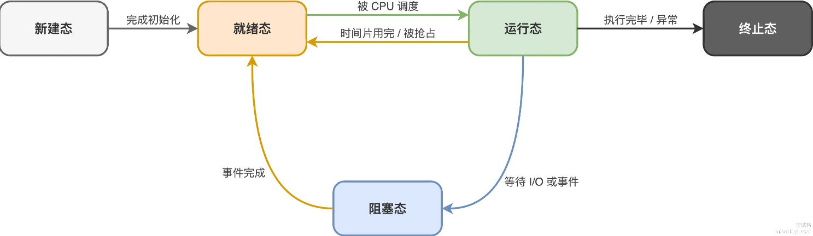
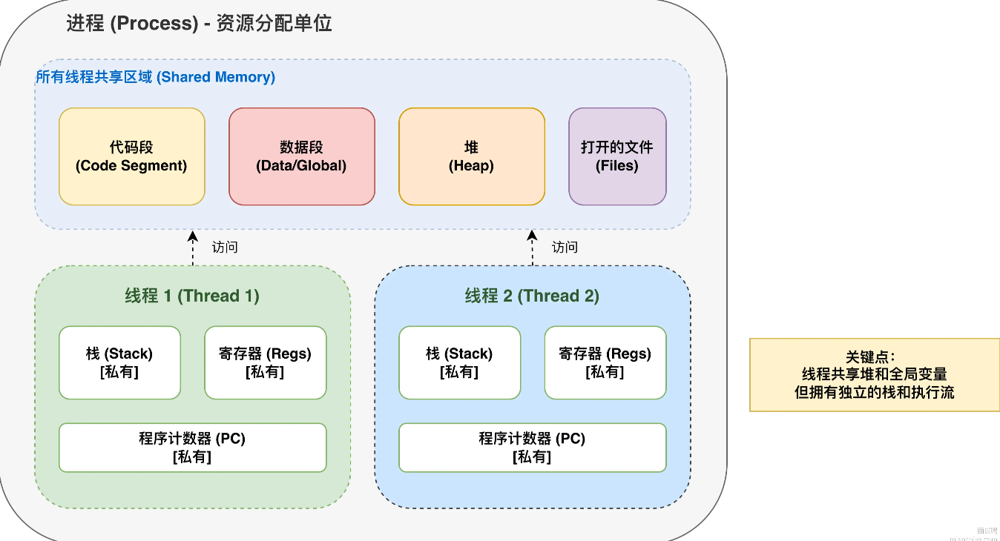
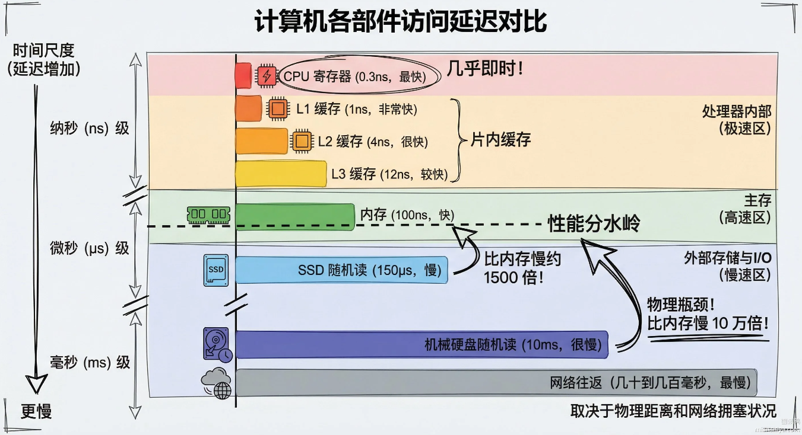

## 整理范围

```
1. 操作系统是什么
       ↓
2. 用户态、内核态、系统调用
       ↓
3. 进程
       ↓
4. 线程
       ↓
5. 进程与线程的区别
       ↓
6. 进程状态与上下文切换
       ↓
7. 进程间通信 IPC
       ↓
8. 线程同步与互斥
       ↓
9. 死锁
       ↓
10. CPU 调度
       ↓
11. 内存管理
       ↓
12. 虚拟内存
       ↓
13. 分页、页表、TLB
       ↓
14. 缺页异常与页面置换
       ↓
15. 文件系统、inode
       ↓
16. I/O 模型
       ↓
17. select / poll / epoll
       ↓
18. 零拷贝
```

操作系统本质上是“应用程序和硬件之间的中间层”。可以先看这张关系：

```
应用程序：Java / MySQL / Redis / 浏览器
        ↓
      操作系统
        ↓
CPU / 内存 / 磁盘 / 网卡 / 其他硬件
```

应用程序通常不会直接操作硬件，而是通过操作系统提供的能力间接完成。比如 Java 程序：

```java
FileInputStream fis = new FileInputStream("a.txt");
fis.read();
```

表面上是 Java 在读文件，但最终大致会变成：

```
Java API
   ↓
JVM
   ↓
操作系统 read 系统调用
   ↓
文件系统
   ↓
磁盘
```

所以操作系统的核心职责，可以概括成两类：管理计算机资源和给应用程序提供统一抽象。例如：

```
硬件资源       操作系统提供的抽象

CPU        →   进程 / 线程
内存       →   虚拟内存 / 分页 / 页面置换
磁盘       →   文件系统
外设       →   I/O 系统
网卡       →   Socket
```

这也是为什么学操作系统时会一直碰到进程、线程、文件、虚拟内存、Socket。

## 用户态、内核态与系统调用

CPU 执行程序的时候，并不是所有代码权限都一样高。现代操作系统通常会把执行权限分成不同级别：用户态（User Mode）和内核态（Kernel Mode）。

- 用户态

  CPU 特权受限，只能执行非特权指令，只能访问受限的内存空间。用户编写的应用程序（如Java 程序、微信、浏览器）运行在这个状态。

  > 为什么不让应用程序直接拥有最高权限？
  >
  > 因为如果任何任何程序都能随便修改页表、操作磁盘、访问任意物理内存、关闭中断、控制网卡、修改其他进程的数据等操作。那么一个 Bug 就可能直接把整个操作系统搞崩。比如：`进程 A：“我要修改地址 0x12345678。”`。如果没有权限隔离，这个地址可能实际上属于操作系统内核或者进程 B。这样进程之间就完全没有安全性可言。因此 CPU 和操作系统提供权限隔离。
  >
  > 那么如果普通程序需要执行特权操作，需要通过操作系统的系统调用来完成。

- 内核态

  CPU 拥有最高特权，可以执行所有指令（包括特权指令，如修改内存页表、操作 I/O 设备等），可以访问所有内存地址。操作系统内核代码就运行在这个状态。

**系统调用**

系统调用（System Call，syscall），它是用户程序向操作系统内核请求服务的一种机制。例如 Linux 中常见的系统调用方法如下：

```
open()、read()、write()、close()、fork()、exec()、socket()、bind()、listen()、accept()

如果执行这个系统调用：read(fd, buffer, 1024);
CPU 会先从用户态，通过系统调用进入内核态，然后操作系统执行相关操作，返回结果到用户态。
```

举一个非常具体的例子。假设执行：

```java
FileInputStream input = new FileInputStream("hello.txt");
input.read();
```

最终可能涉及类似这样的过程：

```
Java 程序
   │
   │ read()
   ↓
JVM / Native Code
   │
   │ 系统调用
   ↓
──────────────
用户态 → 内核态
──────────────
   ↓
Linux Kernel
   ↓
文件系统
   ↓
磁盘驱动
   ↓
磁盘
```

数据读出来以后：

```
磁盘
 ↓
内核缓冲区
 ↓
用户空间
 ↓
Java 程序
```

所以你以后学习 I/O 的时候，会频繁看到一句话：“发生了用户态和内核态切换。”，指的就是这种过程。

**用户态和用户空间是不是一回事？**

严格来说不是。

用户态 / 内核态强调的是：CPU 当前执行代码的权限级别。

用户空间 / 内核空间强调的是：虚拟地址空间的划分。

普通应用代码运行在用户态，通常访问用户空间。操作系统内核运行在内核态，可以访问内核资源以及更广泛的系统资源。

**那么什么时候会从用户态进入内核态？**

最重要的三类是：

1. 系统调用

   这是程序主动进入内核。比如调用 `read()、write()、open()、socket()` 等方法时。

2. 异常

   这是 CPU 执行程序过程中发现了问题。例如，除零、非法指令、缺页异常等。

3. 中断

   通常是硬件主动通知 CPU。例如网卡收到数据，网卡产生中断，CPU 来执行内核中的中断处理程序

**用户态切换到内核态是不是很耗时？**

有一定耗时，开销可能来自多个部分：

```
CPU 权限级别切换
保存 / 恢复执行现场
执行内核代码
缓存影响
数据复制
调度
```

而且一定要区别：`用户态 ↔ 内核态切换和进程上下文切换`。结合 Java 再来看，会更加直观。

例如：`Thread.sleep(1000);`，这不是 JVM 自己在那里死循环，一直检查时间，而是最终依赖操作系统提供的调度能力；`new Thread(...)` 最终也会涉及操作系统线程。

所以后端程序本质上大量依赖操作系统：

```
Java Thread -> 操作系统线程
Java Socket -> 操作系统 Socket
Java File -> 操作系统文件系统
Java NIO -> 操作系统 I/O 多路复用
JVM 内存 -> 操作系统虚拟内存
```

因此操作系统并不是和 Java 割裂的一门课，而是在解释 Java 程序到了 JVM 下面，到底发生了什么。

这一节你可以先记住 5 句话：

```
1. 操作系统负责管理 CPU、内存、磁盘、网卡等硬件资源。
2. 普通应用程序主要运行在用户态，权限受到限制。
3. 操作系统内核运行在内核态，拥有更高权限。
4. 用户程序通过系统调用向操作系统请求服务。
5. 系统调用导致用户态/内核态转换，但不等于一定发生进程上下文切换。
```

## 进程与线程

先从一个问题开始：程序、进程、线程分别是什么？

可以先这样理解：

```
程序 = 磁盘上的一份静态代码
进程 = 正在运行中的程序实例
线程 = 进程内部真正执行代码的执行单元
```

例如你磁盘上有 `Google Chrome.exe` 这只是一个程序。当你启动 Chrome 后，操作系统会创建 Chrome 进程。如果你同时打开多个 Chrome 相关进程，那么同一个程序可以对应多个进程。

### 进程

进程（Process），操作系统进行资源分配和隔离的基本单位。

一个完整进程大致包含：

```
进程
├── 代码
├── 全局变量
├── 堆
├── 栈
├── 打开的文件
├── Socket
├── 虚拟地址空间
├── 线程
└── 其他操作系统资源
```

例如运行：

```java
public class Main {
    public static void main(String[] args) {
        int a = 10;
        Object obj = new Object();
    }
}
```

启动 JVM 后，操作系统创建一个 Java 进程。这个进程拥有自己的：

```
虚拟地址空间
文件描述符
线程
堆等资源
```

所以从操作系统角度看 `java Main` 本质上就是一个进程。

**为什么需要进程？**

最重要的一个原因是资源隔离。例如：

```
进程 A：MySQL
进程 B：Redis
进程 C：Java 应用
```

操作系统不能让 Java 应用随便修改 MySQL 的内存。因此，每个进程通常拥有独立虚拟地址空间。看起来像：

```
进程 A：
0x0000
  ↓
自己的代码、堆、栈
  ↓
0xFFFF


进程 B：
0x0000
  ↓
自己的代码、堆、栈
  ↓
0xFFFF
```

虽然两个进程可能都使用 `0x1000` 这个虚拟地址，但最终映射到的物理内存可以完全不同。所以：

```
进程 A 的 0x1000 -> 物理页 X
进程 B 的 0x1000 -> 物理页 Y
```

这就是进程隔离的重要基础。

#### 进程的创建与终止


#### 进程的状态

进程的状态核心就五个：新建、就绪、运行、阻塞、终止。

1. 新建态（New）：进程刚被创建，操作系统正在为其分配资源（如创建 PCB 进程控制块、分配内存等），尚未进入就绪队列。
2. 就绪态（Ready）：进程已经获得了除 CPU 以外的所有必要资源，正在排队等待操作系统的调度分配时间片。
3. 运行态（Running）：进程正在占用 CPU 执行指令。在单核 CPU 系统中，同一时刻只有一个进程处于此状态；多核系统中则可以有多个进程并行运行。
4. 阻塞态（Blocking/Waiting）：进程因等待某个事件（如 I/O 操作完成、等待锁释放、等待用户输入等）而暂停执行。此时即使 CPU 空闲，该进程也无法运行，必须等事件完成后才能继续。
5. 终止态（Terminated）：进程执行完毕或因异常被终止，操作系统正在回收其占用的资源（如释放内存、关闭文件等）。

**状态间的切换**

1. 就绪态 ↔ 运行态：
   - 就绪 → 运行：CPU 调度器选中了该进程，为其分配 CPU。
   - 运行 → 就绪：进程的时间片用完，或者被更高优先级的进程抢占 CPU。
2. 运行态 → 阻塞态：
   - 进程在运行中主动请求 I/O 或等待某事件（如调用 `read()` 读文件、申请信号量失败），主动放弃 CPU。
3. 阻塞态 → 就绪态：
   - 进程等待的事件完成（如磁盘 I/O 完成、收到信号、锁被释放），被操作系统唤醒。注意：此时进程只能进入就绪态排队，绝不能直接进入运行态。
4. 运行态 → 终止态：
   - 进程正常执行完毕（如 `main` 函数返回），或因异常（如段错误、被 `kill` 信号杀死）而结束。

如下图所示：



#### 进程的上下文及切换

**上下文（Context）**

假设线程 A 正在运行：

```
int a = 10;
int b = 20;
int c = a + b;
```

执行到一半，CPU 要去运行线程 B。以后还得回来继续执行 A。那么操作系统必须记录：

```
A 执行到哪了？
CPU 寄存器里是什么？
栈在哪？
栈顶在哪？
```

这些用于恢复线程执行的信息，就是它的执行上下文，通常包括：

```
程序计数器 PC
CPU 寄存器
栈指针 SP
线程状态
部分调度信息
```

**上下文切换**

上下文切换（Context Switch）：CPU 从一个线程/进程切换到另一个线程/进程时，保存当前执行上下文并恢复另一个执行上下文的过程。

例如 Thread A 正在运行，突然时间片结束。操作系统进行如下操作：

```
1. 保存 A 的程序计数器
2. 保存 A 的寄存器
3. 保存 A 的栈指针等信息
4. 找到 B
5. 恢复 B 的寄存器
6. 恢复 B 的程序计数器
7. 开始运行 B
```

这就是线程上下文切换。

上下文切换发生的主要场景如下：

```
1. 时间片耗尽
2. 线程主动阻塞
3. 等待 I/O
4. 等待锁
5. 更高优先级线程出现
6. Thread.sleep()
7. 主动让出 CPU
```

#### 进程间通信

常见方式：

```
管道 Pipe
命名管道 FIFO
消息队列
共享内存
信号量
Socket
信号 Signal
```

这里非常建议重点理解：为什么共享内存速度通常最快？

因为其他 IPC 往往涉及：

```
用户态
 ↓
内核态
 ↓
数据复制
 ↓
另一个进程
```

而共享内存允许：

```
进程 A ─┐
        ├── 同一块物理内存
进程 B ─┘
```

但共享内存又会引出：

```
并发安全
同步
互斥
信号量
```

这正好进入下一块。


进程间通信（Inter-Process Communication，IPC）。

**为什么进程之间需要专门的通信机制，而线程之间通常不需要？**

因为同一个进程中的线程共享地址空间：

```
进程
├── 线程 A
├── 线程 B
└── 共享堆、全局变量等
```

所以线程 A 可以修改 `static int count = 10;`，线程 B 直接就能看到。但两个不同进程通常拥有独立的虚拟地址空间，进程 A 不能直接访问进程 B 的普通内存。于是就需要操作系统提供一套受控机制。

**常见 IPC 方式**：

```
管道 Pipe
命名管道 FIFO
消息队列 Message Queue
共享内存 Shared Memory
信号量 Semaphore
信号 Signal
套接字 Socket
```

1. 管道（Pipe）

   管道是最基础的 IPC 机制，数据从一端写入，从另一端读出，单项流动。本质上是一块**内核管理的内存缓冲区**。

   - 匿名管道（Anonymous Pipe）：
     - 原理：由 `pipe()` 系统调用创建，数据单向流动（半双工）。
     - 限制：只能用于具有亲缘关系的进程之间（如父子进程）。
   - 命名管道（FIFO）：
     - 原理：在文件系统中创建一个特殊文件（管道文件），不相关的进程可以通过打开这个文件进行通信。
     - 特点：打破了亲缘关系的限制，但依然是半双工，且数据仅存在于内存中。

2. 消息队列（Message Queue）

   在内核中维护一个消息链表，允许进程接收和发送带类型的消息。消息在队列中排队，接收方可以按类型选择性地读取。

   优点：克服了管道只能传输无格式字节流的缺点，消息队列支持**有类型、有边界**的数据块（按消息类型读取）。

   缺点：消息的拷贝需要经过内核，对于大数据量的传输，效率不如共享内存。

3. 共享内存（Shared Memory）

   多个进程将同一块物理内存映射到各自的虚拟地址空间中。进程可以直接读写这块内存，无需经过内核拷贝。

   优点：**最快的 IPC 方式**，因为数据不需要在用户空间和内核空间之间来回拷贝。

   缺点：不提供同步和互斥机制。如果两个进程同时写这块内存，会发生数据竞争。因此，共享内存必须配合信号量（Semaphore）或互斥锁来使用。

   > 既然共享内存这么快，为什么所有 IPC 都不用共享内存？
   >
   > 因为“快”并不等于“最好用”。共享内存需要开发者自己处理：
   >
   > ```
   > 并发控制
   > 数据结构
   > 同步
   > 一致性
   > 内存布局
   > 生命周期
   > 异常恢复
   > ```
   >
   > 而 Socket 使用起来就简单很多。所以工程设计里永远不是最快 = 最好，还要考虑：易用性、可靠性、隔离性、扩展性、开发成本等。

4. 信号量（Semaphore）

   本质上是一个计数器（通常配合互斥锁使用），用于控制多个进程对共享资源的访问，实现互斥访问或者限流。

   - 核心操作：
     - P 操作（wait/down）：申请资源，计数器减 1。若减后小于 0，则进程阻塞等待。
     - V 操作（signal/up）：释放资源，计数器加 1。若加后小于等于 0，则唤醒一个等待的进程。
   - 定位：信号量本身不用于传递数据，它是专门用来做进程同步与互斥的机制，通常作为其他 IPC（如共享内存）的辅助工具。

5. 信号（Signal）

   一种异步通知机制，用来告诉进程发生了某个事件。信号只能传递一个信号编码，不能带复杂数据。

6. Socket

   最灵活，它是唯一支持网络通信的 IPC 机制。不仅可以在同一台机器的进程间通信（如 Unix Domain Socket），还可以跨网络通信（TCP/UDP）。


#### 进程的调度算法

重点：

```
先来先服务 FCFS
短作业优先 SJF
最短剩余时间优先 SRTF
优先级调度
时间片轮转 RR
多级反馈队列 MLFQ
```

重点理解三个概念：

```
周转时间：从进程提交到完成的时间，包括等待、执行和 I/O 等所有时间。
等待时间：进程在就绪队列中等待 CPU 分配时间片的时间总和。
响应时间：从进程提交到第一次分配给它 CPU 时间的时间间隔。

CPU 的利用率：CPU 在实际工作中的时间比例，是衡量 CPU 是否被有效利用的指标。
CPU 的吞吐量：单位之间内完成的进程数量，通常用于衡量系统处理能力。
```

尤其要理解：为什么现代操作系统普遍需要时间片？


在复习这部分内容时，建议按照**“非抢占式 → 抢占式 → 复杂组合 → 实时系统”**的逻辑框架进行梳理：

**非抢占式调度算法**

这类算法的特点是：进程一旦获得 CPU，就会一直运行，直到执行完毕或主动阻塞（如等待 I/O），系统不会强制剥夺其 CPU 使用权。

1. 先来先服务（FCFS, First-Come-First-Served）

   - 原理：按照进程到达就绪队列的先后顺序分配 CPU。
   - 优缺点：实现最简单，绝对公平，但可能会产生饥饿现象，即先到达的长进程长时间占用 CPU，导致后续到达的短进程长时间等待，降低了系统的响应时间。同时也容易引发护航效应（Convoy Effect），即 I/O 密集型进程可能会阻塞 CPU 密集型进程，导致资源利用率低下。
   - 适用场景：批处理系统。

2. 短作业优先（SJF, Shortest Job First）

   - 原理：优先调度预计运行时间最短的进程。
   - 优缺点：理论上可以使得所有进程的平均等待时间达到最短。缺点是必须预知或估算进程的运行时间（实际难以准确实现），且容易导致长作业一直得不到执行，产生饥饿（Starvation）现象。
   - 适用场景：批处理系统。

3. 最高响应比优先算法（HRRN, Highest Response Ratio Next）

   - 原理：它在每次调度时，会计算就绪队列中所有进程的响应比，并选择响应比最高的进程执行。

     其核心计算公式为：响应比（R） = (等待时间 + 要求服务时间) / 要求服务时间

   - 优缺点：克服了 SJF 算法中长作业饥饿的问题，克服了 FCFS 算法中不考虑作业长短的问题，综合考虑了等待时间和服务时间，相对公平。但是，系统开销较大，每次调度都需要遍历就绪队列，计算所有进程的响应比，增加了 CPU 的负担。依然属于非抢占式算法，无法满足强实时系统的紧急响应需求。

   - 适用场景：批处理系统。

**抢占式调度算法**

这类算法允许操作系统在某些条件触发时（如时间片用完、高优先级进程到达），强制剥夺当前进程的 CPU 使用权，重新分配给其他进程。

1. 时间片轮转（RR, Round Robin）
   - 原理：专为分时系统设计。系统为每个进程分配一个固定的时间片（如 10ms），时间片用完后，进程被强制暂停并排到就绪队列末尾，等待下一次调度。
   - 优缺点：公平性好，每个进程都能分到 CPU，响应时间短，非常适合交互式系统。缺点是如果时间片设置过短，会导致频繁的上下文切换，增加系统开销；设置过长则退化为 FCFS。
   - 适用场景：交互式系统（如桌面操作系统）。
2. 优先级调度（Priority Scheduling）
   - 原理：为每个进程分配一个优先级，调度器总是选择优先级最高的进程执行。可分为静态优先级（创建时确定）和动态优先级（随运行状态调整）。
   - 优缺点：能确保关键任务得到及时处理。缺点是低优先级进程可能长期得不到 CPU 而产生“饥饿”。
   - 解决方案：引入“老化（Aging）”机制，即随着等待时间的增加，动态提升进程的优先级。

**复杂组合与现代调度算法**

现代操作系统通常不会使用单一的算法，而是采用组合策略来兼顾各种性能指标。

1. 多级反馈队列（MLFQ, Multilevel Feedback Queue）
   - 原理：结合了时间片轮转和优先级调度的优点。系统设置多个就绪队列，每个队列优先级不同、时间片大小不同。新进程进入最高优先级队列；如果在一个时间片内未完成，则被降级到下一队列（时间片变长）；低优先级队列的进程若长期等待，会被提升优先级（防饥饿）。
   - 特点：综合权衡了响应时间和吞吐量，是通用操作系统（如 Unix、Windows）中最常用的算法。
2. 完全公平调度器（CFS, Completely Fair Scheduler）
   - 原理：Linux 内核默认的调度算法。它基于“虚拟运行时间”分配 CPU，优先级高的进程虚拟时间增长慢。调度器总是挑选虚拟运行时间最少的进程来执行，以保证绝对的公平性。

#### 僵尸进程和孤儿进程

**僵尸进程（Zombie）**

子进程执行结束后，操作系统不会立刻把它的所有信息删除，而是保留一小部分退出信息，例如：PID、退出码等信息。需要父进程调用 `wait()/waitpid()` 来获取。如果父进程不调用，那子进程的退出信息还保留在进程表中，虽然不占用 CPU 和内存，但是会占用 PID 和进程表项，如果积累太多，系统就没法创建新进程了。

解决方式：

- 让父进程主动调用 `wait()/waitpid()` 来回收；

- 通过 `SIGCHILD` 信号回收。子进程退出时，内核会向父进程发送 `SIGCHLD`，父进程使用 `waitpid()` 来处理；

- 如果已经出现了僵尸进程，那么找到僵尸进程的父进程，让父进程来回收。也可以直接终止父进程。

  > 注意：使用 `kill` 来杀僵尸进程没有意义，因为僵尸进程已经结束了，只是占用了 PID 号和进程表项。

**孤儿进程（Orphan）**

父进程先退出，但子进程还在运行。操作系统会把孤儿进程托管给 PID 为 1 的 init 进程，init 会在孤儿进程终止后自动清理它的资源。孤儿进程本身没啥危害，init 会负责接管。

### 线程

线程（Thread），进程内部的执行单元，是 CPU 调度和执行的基本单位。

比如一个 Java 进程中可能有：

```
Java 进程
├── main 线程
├── GC 线程
├── HTTP 工作线程
├── 定时任务线程
└── 其他 JVM 线程
```

所有这些线程都属于同一个进程。

**为什么有了进程，还需要线程？**

假设没有线程。一个 Web 服务器需要同时处理多个用户的请求，如果只能靠多个进程来处理。当然也可以，但问题是：

```
创建进程成本较高
进程之间通信较麻烦
进程上下文切换成本较高
```

于是引入线程。由一个进程下的多个线程来分别处理多个用户的请求，这些线程共享大量资源，因此：

```
创建成本更低
通信更方便
切换通常也更轻量
```

所以线程可以看作一种更轻量级的并发执行单位。

**进程中的多个线程一定能够并行吗？**

不一定。取决于 CPU 的核心数。

如果只有 1 个核心，那么任意瞬间通常只能真正执行一个线程，这种叫做并发（Concurrent）。

如果有多个核心，那么每个核心会执行一个线程，这种叫做并行（Parallel）。

#### 线程的状态


#### 用户线程和内核线程是什么？


#### 线程间通信


### 总结

**进程与线程共享什么？**

同一个进程中的线程，一般共享：

```
代码段
堆
全局数据
打开的文件
Socket
进程地址空间
```

但是每个线程拥有自己独立的：

```
程序计数器 PC
寄存器
线程栈
线程状态
```



这非常关键。比如 Java：

```java
class Demo {
    static int count = 0;
    public static void main(String[] args) { int x = 10; }
}
```

其中 `count` 属于共享数据，多个线程都可能访问。但每个线程自己调用某个方法时，它自己的局部变量通常位于自己的线程栈中。所以：

```
堆上的共享对象 → 可能产生线程安全问题
线程自己的栈 → 通常天然隔离
```

这正是 Java 并发很多问题的操作系统基础。

**为什么线程切换通常比进程切换成本低？**

> 同一进程中的线程共享进程的虚拟地址空间、代码段、堆、文件等资源，因此线程切换时主要需要切换线程自身的程序计数器、寄存器、栈指针等执行上下文。而进程切换除了执行上下文外，还通常需要切换地址空间和页表相关状态，并可能对 TLB 和 CPU Cache 产生更明显的影响，因此进程上下文切换通常成本更高。

因为进程切换时，不只是执行现场不同。通常涉及：

```
寄存器切换
栈切换
调度信息切换
虚拟地址空间切换
页表相关状态变化
TLB / Cache 影响，
```

而同一进程中的线程间切换时，因为两者共享同一个虚拟地址空间和同一套进程资源。所以通常不需要切换整个地址空间。主要保存和恢复：

```
寄存器
程序计数器
栈指针
线程调度状态
```

因此线程上下文切换通常比进程上下文切换更轻量

注意这里最好用通常，而不是说线程切换“一定”比进程切换快，因为实际开销还与 CPU Cache、调度器、体系结构等因素有关。

**进程与线程的区别**

进程是操作系统进行资源分配和隔离的基本单位，线程是 CPU 调度和执行的基本单位。

每个进程都有独立的虚拟地址空间，比如堆、代码段、数据段等。因此进程之间相互隔离。创建和切换成本都比较高，进程间通信需要通过 IPC。

同一进程的线程则是共享进程的大部分资源，比如堆、代码段、数据段、打开的文件资源等；同时每个线程有自己独立的栈和寄存器等。因此，创建和切换成本比较低，线程间可以直接通过共享内存通信，但需要处理并发问题。


## 并发、同步与死锁

这一部分和你之前复习的 Java 并发可以很好地联系起来。

核心问题其实就是：

> 多个线程同时访问共享资源怎么办？

首先掌握：

```
临界区
竞态条件 Race Condition
互斥 Mutex
同步 Synchronization
信号量 Semaphore
```

然后理解几个经典问题：

```
生产者消费者问题
哲学家就餐问题
读者写者问题
```

不一定需要背复杂代码，重点理解：

```
谁在竞争资源？
为什么会发生冲突？
怎样保证互斥？
怎样保证执行顺序？
```

然后重点学习：死锁

一定掌握死锁四个必要条件：

```
互斥
请求并保持
不可剥夺
循环等待
```

以及：

```
死锁预防
死锁避免
死锁检测
死锁解除
```

其中比较著名的是：

```
银行家算法
```

面试里经常问：

> Java 中如何避免死锁？

本质上就可以从破坏死锁四个必要条件入手。

比如：

```
synchronized (lockA) {
    synchronized (lockB) {
    }
}
```

所有线程统一按照：

```
lockA → lockB
```

的顺序加锁，就相当于尝试破坏“循环等待”。


### 死锁

死锁是指在多道程序环境下，多个进程因竞争资源而造成的一种僵局。如果没有外力作用，这些进程都将永远处于阻塞状态，无法向前推进。

**死锁产生的条件**：

死锁的发生必须同时满足以下四个条件，这也是后续所有预防和避免策略的突破口：

1. 互斥条件：进程对所分配到的资源进行排他性使用，即在一段时间内某资源只由一个进程占用。
2. 请求和保持条件：进程已经保持了至少一个资源，同时又提出了新的资源请求，而该资源被其他进程占有，此时请求进程阻塞，但对自己已获得的资源保持不放。
3. 不剥夺条件：进程已获得的资源在未使用完之前，不能被强行剥夺，只能由占有该资源的进程主动释放。
4. 循环等待条件：存在一种进程资源的循环等待链，链中的每一个进程已获得的资源同时被链中下一个进程所请求。

**死锁的预防**：

预防是一种静态策略。它在系统运行前，通过破坏死锁产生的四个必要条件中的任意一个，来保证死锁绝不会发生。

- 破坏互斥条件：通常不可行，因为很多资源（如打印机、互斥锁）本身就必须互斥访问。
- 破坏请求和保持条件：采用“静态分配策略”，要求进程在运行前一次性申请所需的全部资源。只要有一个资源不满足，进程就不分配任何资源。
- 破坏不剥夺条件：如果进程申请新资源失败，系统会强制剥夺其当前已占有的所有资源，直到它重新申请。
- 破坏循环等待条件：采用“顺序资源分配法”，对系统中的所有资源进行线性编号，进程必须按递增的顺序申请资源。

**死锁的避免**：

避免是一种动态策略。系统允许死锁的四个必要条件存在，但在运行过程中，通过对资源的分配进行动态检查和干预，确保系统永远不进入“不安全状态”。

核心概念：安全状态与不安全状态

- 安全状态：系统能按某种顺序（安全序列）为每个进程分配资源，并保证所有进程都能顺利完成。
- 不安全状态：系统无法保证所有进程都能顺利完成（注意：不安全状态不等于死锁状态，只是有可能发生死锁）。
- 避免死锁的本质：就是保证系统始终处于安全状态。

比如经典算法：银行家算法（Banker's Algorithm），当进程提出资源请求时，系统先进行试探性分配。然后运行“安全性算法”检查系统是否仍处于安全状态：

- 如果安全，则正式分配资源。
- 如果不安全，则拒绝此次请求，让进程等待。

## 内存管理

这是操作系统另一大核心，也是面试高频。

建议按照：

```
物理内存
   ↓
虚拟内存
   ↓
分页
   ↓
页表
   ↓
TLB
   ↓
缺页异常
   ↓
页面置换
```

这个顺序学习。

首先理解：

> 为什么需要虚拟内存？

例如一个程序认为自己的地址空间是：

```
0x00000000
     ↓
0xffffffff
```

但实际上这些都是：

```
虚拟地址
```

CPU 访问时：

```
虚拟地址
   ↓
MMU
   ↓
页表
   ↓
物理地址
```

于是每个进程都可以认为：

```
“我拥有一整块连续内存。”
```

实际上底层物理内存可能非常零散。

这里必须掌握：

```
分页
页
页框
页表
多级页表
TLB
```

尤其是：

> 为什么需要 TLB？

因为如果每访问一次内存都要先访问页表：

```
CPU
 ↓
访问页表
 ↓
获得物理地址
 ↓
再访问真正的数据
```

开销太大。

所以 CPU 维护：

```
TLB = 页表的高速缓存
```


## 缺页异常与页面置换

这是虚拟内存中非常重要的一块。

程序访问：

```
虚拟页 10
```

发现：

```
页表：
虚拟页 10 → 不在物理内存
```

于是触发：

```
Page Fault
缺页异常
```

操作系统：

```
1. 暂停当前程序
2. 从磁盘找到对应页面
3. 加载进物理内存
4. 修改页表
5. 重新执行指令
```

如果内存已经满了：

```
需要淘汰一个页面
```

于是引出页面置换算法：

```
FIFO
OPT
LRU
Clock
```

面试最常见的是：

```
LRU
```

这也可以和你之前学 Redis 联系起来：

```
操作系统页面置换
Redis 内存淘汰
CPU Cache
```

很多地方都有类似的缓存淘汰思想。


## 文件系统

这一部分重点理解“文件到底是怎么存到磁盘上的”。

建议掌握：

```
文件
目录
文件描述符
inode
磁盘块
文件系统
```

Linux 下尤其重要 `inode`

一个文件实际上可以简单理解为：

```
文件名
   ↓
inode
   ↓
磁盘数据块
```

注意：文件名并不保存在 inode 中。

目录本质上保存：`文件名 → inode 编号`

然后继续学习硬链接和软链接。这个非常适合通过 inode 来理解，而不要直接背区别。


### 文件描述符


## I/O

后端开发尤其建议重点学这一部分。

因为之后你会遇到：

```
BIO
NIO
Netty
Redis
Linux epoll
```

首先理解：

> 一次网络 I/O 到底发生了什么？

例如：

```
客户端发送数据
      ↓
网卡
      ↓
内核缓冲区
      ↓
用户进程缓冲区
      ↓
应用程序
```

这里要重点区分两个过程：

```
1. 等待数据准备好
2. 把数据从内核复制到用户空间
```

然后学习五种经典 I/O 模型：

```
阻塞 I/O
非阻塞 I/O
I/O 多路复用
信号驱动 I/O
异步 I/O
```

其中最重要的是：

```
I/O 多路复用
```

也就是：

```
select
poll
epoll
```

重点理解：epoll 为什么适合大量连接？

这部分之后可以直接和：

```
Java NIO
Netty
Redis 单线程模型
```

联系起来。


I/O（Input/Output），也就是输入/输出。对于操作系统来说，I/O 主要指 CPU 和外部设备之间的数据交换，例如：磁盘、网卡、键盘、显示器、鼠标等。对于后端开发来说，最重要的基本就是两类：

```
磁盘 I/O
网络 I/O
```

CPU 很快（纳秒级），但磁盘（微秒级）、网络（毫秒级）这些设备相对慢很多。



### I/O 模型分类

I/O 模型主要有五种，核心区别在于等待数据和拷贝数据，这两个阶段是否会阻塞线程。

1. 阻塞 I/O
2. 非阻塞 I/O
3. I/O 多路复用
4. 信号驱动 I/O
5. 异步 I/O

要透彻理解这些模型，首先需要明确一次完整的 I/O 操作通常包含两个核心阶段：

1. 等待数据准备阶段：数据从外部设备到达内核缓冲区。
2. 数据拷贝阶段：数据从内核缓冲区拷贝到用户进程空间。

#### 同步阻塞 I/O

- **原理**：这是最简单、最流行的模型。当用户线程发起 I/O 请求（如 `read`）时，如果数据未准备好，线程会被完全阻塞（挂起），直到数据准备完毕并被内核把数据拷贝到用户空间，操作才返回。
- **特点**：在“等待数据”和“数据拷贝”两个阶段均处于阻塞状态。
- **优缺点**：编程模型简单直观，但并发能力极差（一个连接需要一个线程），资源消耗大。

#### 同步非阻塞 I/O

- **原理**：进程将套接口设置为非阻塞。当数据未准备好时，内核不会阻塞进程，而是立即返回一个错误码（如 `EWOULDBLOCK`）。进程必须不断主动轮询（Polling）来检查数据是否就绪，就绪后再执行数据拷贝。
- **特点**：“等待数据”阶段不阻塞（通过轮询），但“数据拷贝”阶段依然阻塞。
- **优缺点**：避免了线程挂起，但频繁的轮询会大量消耗 CPU 资源，导致 CPU 空转。

#### I/O 多路复用

- **原理**：通过 `select`、`poll` 或 `epoll` 等系统调用，让一个线程同时监控多个文件描述符（连接）。当其中任何一个描述符的数据就绪时，系统调用就会返回，通知应用程序去执行真正的 I/O 操作。
- **特点**：进程阻塞在 `select/poll/epoll` 调用上，而不是阻塞在真正的 I/O 系统调用上。真正的数据拷贝阶段依然是阻塞的。
- **优缺点**：极大地减少了线程数量和上下文切换开销，单线程即可管理大量连接。它是目前高并发网络服务器（如 Nginx、Redis）的核心技术。

**Select、Poll、Epoll 及区别？**

它们都是操作系统中用于 I/O 多路复用的机制，让一个线程能同时监控多个文件描述符的状态。

1. Select

   最早的实现，用固定长度的位图表示文件描述符集。每次调用都要把整个位图从用户态拷贝到内核态，内核线性扫描所有描述符检查状态。

   支持的文件描述符数量固定为 1024，大规模连接场景下效率很低。

2. Poll

   改进了 Select 的描述符数量限制，用动态数组来存储文件描述符，理论上可以监控任意数量。

   但每次调用还是得把整个数组拷贝到内核，内核还是得遍历全部描述符，大量连接时效率问题依然存在。

3. Epoll

   是 Linux 专门优化的版本，用红黑树管理注册的描述符，用就绪链表存储触发的事件。

   描述符只需要注册一次，后续不用反复拷贝。调用 `epoll_wait` 时只返回有事件的描述符，不用遍历所有注册的描述符。支持边缘触发和水平触发两种模式，适合高并发服务器。

   - 边缘触发（ET，Edge Triggered）

     仅在状态发生变化时通知一次，需要用户在事件发生时读取所有数据，否则可能会错过后续事件。减少了重复事件通知的次数，但增加了编程的复杂度，通常需要结合非阻塞 I/O 使用。

   - 水平触发（LT，Level Triggered）- 默认模式

     类似于 `select/poll` 的工作方式，只要文件描述符上有未处理的数据，每次调用 `epoll_wait` 都会返回该文件描述符。

**实际开发中如何选择？**

对于连接数少、活跃度高的场景，select/poll 就够用了。而 epoll 的优势在这个场景体现不出来，因为每个连接都要 `epoll_ctl` 注册一次，连接一断又要删除，频繁的红黑树操作反而有开销。。

#### 信号驱动 I/O

- **原理**：应用程序向内核注册一个信号处理函数，然后立即返回继续执行。当内核将数据准备好后，会向应用进程发送 `SIGIO` 信号。进程在信号处理函数中执行数据拷贝操作。
- **特点**：“等待数据”阶段是异步的（不阻塞），但“数据拷贝”阶段依然阻塞。
- **优缺点**：避免了轮询，CPU 利用率高。但由于信号处理编程复杂，且存在信号队列溢出的风险，在实际 TCP 网络编程中并不常用。

#### 异步 I/O

- **原理**：这是真正的非阻塞模型。应用程序发起 I/O 请求（如 `aio_read`）后立即返回，继续执行其他任务。内核负责完成所有操作（包括等待数据和将数据拷贝到用户空间），全部完成后通过回调函数或信号通知应用程序。
- **特点**：在“等待数据”和“数据拷贝”两个阶段**均不阻塞**进程。
- **优缺点**：并发性能极高，线程没有任何等待开销。但由于实现极其复杂，且 Linux 系统对其支持不够完善，实际应用中相对较少（Windows 的 IOCP 实现了真正的异步 I/O）。

### 同步 I/O 与异步 I/O

区分同步与异步。**判断的核心标准是：第二阶段（数据从内核拷贝到用户空间）是否阻塞了请求进程。**

- **同步 I/O**：前四种模型（阻塞、非阻塞、I/O多路复用、信号驱动）都属于同步 I/O。因为在数据拷贝阶段，进程都需要主动调用 `read/recvfrom` 并阻塞等待。
- **异步 I/O**：只有第五种模型是真正的异步 I/O，整个 I/O 过程都不导致请求进程阻塞。

### 同步、异步、阻塞、非阻塞 I/O 的区别？

阻塞/非阻塞：指的是发起 I/O 请求时用户线程的状态。

同步/异步：指的是内核拷贝数据时用户线程的状态。


### Reactor


## 零拷贝

如果是 Java 后端面试，建议额外重点学。

正常数据发送：

```
磁盘
 ↓
内核缓冲区
 ↓
用户缓冲区
 ↓
Socket 缓冲区
 ↓
网卡
```

存在多次：

```
数据复制
用户态 / 内核态切换
```

于是出现：

```
mmap
sendfile
零拷贝
```

然后就可以联系：

```
Kafka 为什么快？
Netty 为什么使用零拷贝？
Java NIO FileChannel.transferTo()
```
