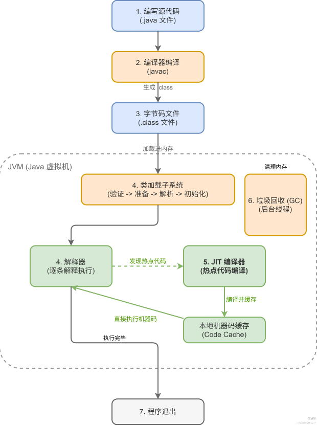
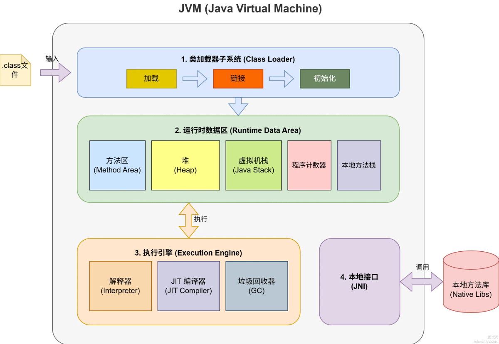
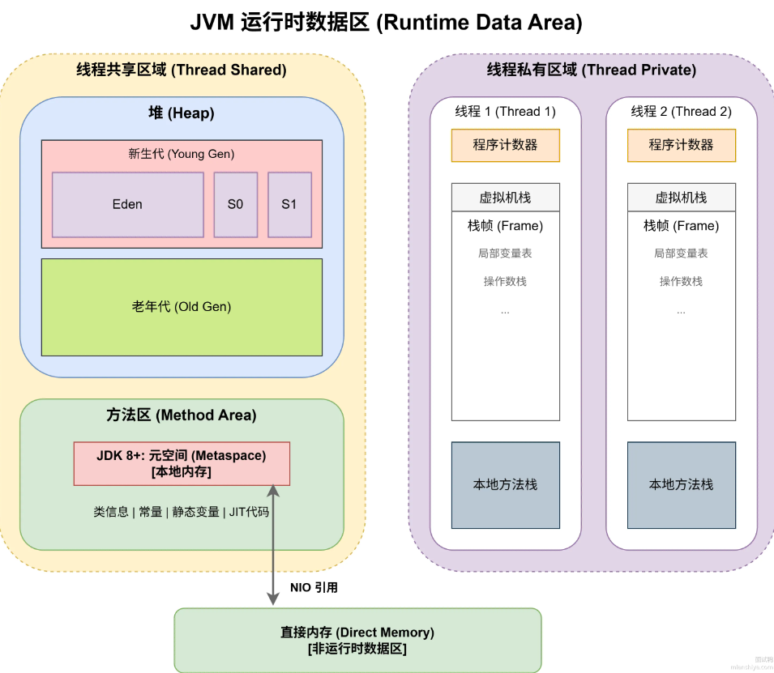

JVM 的结构、功能。

- **内存模型**：堆、栈、方法区（元空间）的划分及各自存储的内容。
- **垃圾回收 (GC)**：如何判断对象已死（可达性分析）、常见的 GC 算法（标记-清除、复制、标记-整理）、以及主流垃圾收集器（CMS、G1、ZGC）的特点和适用场景。
- **类加载机制**：双亲委派模型及其打破场景。

> JVM 不应该按章节孤立地背。建议建立“Java 程序从出生到死亡”的完整模型
>
> 建议按照：
>
> ```
> .java
> ↓
> javac
> ↓
> .class
> ↓
> 类加载
> ↓
> 运行时内存
> ↓
> 对象创建
> ↓
> 对象存活
> ↓
> GC
> ↓
> 对象回收
> ```
>
> 这样复习。
>
> 第一部分是 JVM 内存结构：
>
> ```
> 线程共享：
> 堆
> 方法区 / 元空间
> 
> 线程私有：
> 程序计数器
> 虚拟机栈
> 本地方法栈
> ```
>
> 重点理解：
>
> ```
> 对象放哪里？
> 局部变量放哪里？
> Class 信息放哪里？
> 静态变量放哪里？
> 字符串常量池在哪里？
> ```
>
> 第二部分是对象：
>
> ```
> 对象创建过程
> 对象内存布局
> 对象头
> Mark Word
> 指针压缩
> 对象访问方式
> ```
>
> 第三部分是 GC，这是 JVM 的核心：
>
> ```
> 如何判断对象死亡
> ├── 引用计数
> └── 可达性分析
> 
> 引用类型
> ├── 强引用
> ├── 软引用
> ├── 弱引用
> └── 虚引用
> 
> GC 算法
> ├── 标记-清除
> ├── 标记-复制
> └── 标记-整理
> 
> GC 收集器
> ├── Serial
> ├── Parallel
> ├── CMS
> ├── G1
> └── ZGC
> ```
>
> 其中现在建议重点掌握：
>
> ```
> G1
> ZGC
> ```
>
> 但 CMS 依然应该懂，因为很多 JVM 问题会从 CMS 讲到 G1。
>
> 第四部分是类加载：
>
> ```
> 加载
> ↓
> 验证
> ↓
> 准备
> ↓
> 解析
> ↓
> 初始化
> ```
>
> 再结合：
>
> ```
> 双亲委派
> ClassLoader
> Bootstrap ClassLoader
> Platform ClassLoader
> Application ClassLoader
> ```
>
> 最后一定要复习 JVM 排障：
>
> ```
> CPU 100%
> 内存泄漏
> OOM
> 频繁 Full GC
> 线程死锁
> ```
>
> 以及工具：
>
> ```
> jps
> jstack
> jmap
> jstat
> jcmd
> VisualVM
> Arthas
> MAT
> ```
>
> 面试中经常会出现：
>
> > 线上 CPU 突然 100% 怎么排查？
>
> 这种题实际上同时考：
>
> ```
> Linux
> Java 线程
> JVM
> 线程栈
> 代码定位
> ```
>
> ```
> JVM
>  │
>  ├── 1. JVM 运行时数据区
>  │     ├── 程序计数器
>  │     ├── Java 虚拟机栈
>  │     ├── 本地方法栈
>  │     ├── 堆
>  │     └── 方法区 / 元空间
>  │
>  ├── 2. 对象
>  │     ├── 对象怎么创建
>  │     ├── 对象内存布局
>  │     ├── 对象怎么访问
>  │     └── 对象什么时候死亡
>  │
>  ├── 3. 垃圾回收
>  │     ├── GC Roots
>  │     ├── 可达性分析
>  │     ├── 标记-清除
>  │     ├── 标记-复制
>  │     ├── 标记-整理
>  │     └── 分代收集
>  │
>  ├── 4. 垃圾收集器
>  │     ├── Serial
>  │     ├── Parallel
>  │     ├── CMS
>  │     ├── G1
>  │     └── ZGC
>  │
>  ├── 5. 类加载机制
>  │     ├── 加载
>  │     ├── 验证
>  │     ├── 准备
>  │     ├── 解析
>  │     ├── 初始化
>  │     └── 双亲委派
>  │
>  ├── 6. 字节码与执行引擎
>  │     ├── .class 文件
>  │     ├── 字节码
>  │     ├── 解释器
>  │     └── JIT
>  │
>  └── 7. JVM 调优
>        ├── OOM
>        ├── CPU 飙高
>        ├── GC 频繁
>        ├── 内存泄漏
>        ├── jps
>        ├── jstack
>        ├── jmap
>        └── jstat
> ```
>
> 


## JVM 及组成

Java 虚拟机，也就是 JVM（Java Virtual Machine），可以把它理解成：Java 程序和操作系统之间的一层运行环境。

JVM 负责加载并执行 Java 字节码，同时负责 Java 程序的运行时内存管理、垃圾回收以及部分运行时优化。

真正的计算机有 CPU、内存、指令集、寄存器、线程等。JVM 也抽象出了一套自己的运行环境，比如：

```
JVM 指令集
JVM 栈
JVM 堆
程序计数器
类加载机制
垃圾回收机制
```

Java 会针对不同的平台有对应的 JVM：

```
同一份 .class 字节码
      ↓
Windows JVM → Windows 机器指令
Linux JVM   → Linux 机器指令
macOS JVM   → macOS 机器指令
```

Java 程序的大致运行需要经历编译和执行两大阶段，编译阶段把源代码转为字节码，执行阶段由 JVM 加载字节码并运行，具体流程如下：

```
源代码 ->  -> JVM -> 加载字节码 -> 运行时内存 -> 解释执行/JIT 编译 -> 机器指令 -> CPU 执行
1. 编写源代码
2. 编译成字节码：javac 编译器把源代码编译成 .class 字节码文件
3. 类加载：JVM 启动后，类加载器把 .class 字节码文件读入内存，经过验证、准备、解析、初始化这几个阶段
4. 执行字节码：解释器逐条翻译字节码为机器码执行，同时 JIT 编译器监控哪些代码是热点
5. JIT 编译优化：跑得多的热点代码被 JIT 编译成机器码缓存起来，下次直接跑机器码，无需再次进行翻译
6. 垃圾回收：程序运行过程中，GC 线程再后台回收不用的对象，释放堆内存
7. 程序退出：main 方法返回，JVM 做清理工作后退出
```



JVM 主要由四个部分组成：类加载器子系统（ClassLoader）、运行时数据区（Runtime Data Area）、执行引擎（Execution Engine）、以及本地方法接口（Native Interface，简称 JNI）。如下图所示：



对于写好的 Java 代码被编译成 .class 文件后，JVM 各个部分的处理如下：

1. 类加载器负责把 class 文件从磁盘或网络中放到内存里。
2. 运行时数据区就是内存的仓库，用于存放代码、变量这些数据。
3. 执行引擎类似于翻译官，把 Java 字节码转成机器能懂的指令去执行。
4. 如果需要调用 C++ 之类的外部代码，比如访问硬件，JNI 就负责处理。


JVM 的框架：

```
                    JVM
                     │
        ┌────────────┼─────────────┐
        │            │             │
     类加载         内存管理       执行引擎
        │            │             │
 ClassLoader      运行时数据区     解释器
 类加载过程        堆             JIT
 双亲委派          虚拟机栈        GC
                  方法区
                  程序计数器
                  本地方法栈
```

其中最核心的是四大部分：

```
1. 类加载机制
2. JVM 运行时内存结构
3. 垃圾回收 GC
4. JVM 执行引擎
```

面试和实际开发中，前 3 个尤其重要。

**JDK、JRE、JVM 的关系**

这是 JVM 最基础的问题。

可以理解成：

```
JDK
├── 开发工具
│   ├── javac
│   ├── javadoc
│   ├── jdb
│   └── ...
└── Java 运行环境 JRE
    ├── JVM
    └── Java 核心类库
```

不过现代 JDK（Java 9 之后）已经不再按照过去那种独立 JRE 目录结构来组织，因此这个关系主要用于理解概念，不要把它理解成现代 JDK 目录一定存在一个 `jre/` 文件夹。

## 类加载器

Java 源代码文件被编译为 `.class` 文件，但是并不会直接进入 JVM，而是先需要 ClassLoader 来把类加载进 JVM。

类加载的主要过程分为如下步骤：

1. 加载阶段（Loading），找到类文件并读取字节流，在方法区创建对应的类元数据。
2. 链接阶段（Linking），分为：
   - 验证（Verification），验证字节码格式是否合规；
   - 准备（Preparation），给静态变量分配内存并设默认值；
   - 解析（Resolution），把符号引用转成直接引用。
3. 初始化阶段（Initialization），执行类的静态代码块和静态变量赋值，这时候才真正跑用户写的初始化逻辑。

### 类加载的种类

虚拟机设计团队把加载动作放到 JVM 外部实现，以便让应用程序决定如何获取所需的类，JVM 提供了3种类加载器：

1. 启动类加载器（Bootstrap ClassLoader） 是顶层的，C++ 写的，负责加载 `<JAVA_HOME>\lib` 目录下的核心类库，比如 rt.jar、resources.jar。在 Java 代码里获取它的引用会返回 null。

2. 扩展类加载器（Extension ClassLoader）时次顶层的，Java 写的，负责加载 `<JAVA_HOME>\lib\ext` 目录中的扩展类库，或者被`java.ext.dirs` 系统变量指定的路径。

   > 在 JDK 9 中，拓展类加载器更名为 Platform ClassLoader，整体变成了模块化的类加载方式。

3. 应用类加载器（Application ClassLoader）Java 写的，负责加载用户路径（classpath）下的类，包括我们自己写的代码和引入的第三方 jar 包。JVM 通过双亲委派模型进行类的加载，当然我们也可以通过继承 `java.lang.ClassLoader` 实现自定义的类加载器。

3 个类加载器之间是父子委托关系，不是继承关系，通过 parent 字段关联。加载类时现委托给父加载器，父加载器找不到才自己加载。

### 双亲委派机制

**什么是双亲委派机制？**

当一个类加载器收到了类加载请求时，首先不会尝试自己去加载这个类，而是把这个请求委派给父加载器，一直委派到最顶层的 Bootstrap ClassLoader。如果父加载器加载不了，才轮到自己加载。

> 双亲委派模型不是强制规定的，你不遵守也不会报错，只是 Java 设计者推荐的一种类加载器实现方式。

双亲委派的好处：

1. 保证核心类库的安全。`java.lang.Object` 永远由 Bootstrap ClassLoader 加载，就算有人恶意写了个同名的 Object 类放到 classpath 下，也不会被加载。因为请求先委派给 Bootstrap，Bootstrap 在 rt.jar 里找到了就直接返回。
2. 避免类重复加载。同一个类在 JVM 中只会被加载一次，保证类的唯一性。

为什么需要双亲委派？

如何打破双亲委派？

## 运行时数据区

Java 运行时数据区（JVM Runtime Data Area）是 JVM 内存管理的核心，按照线程是否共享分为两个区域：

1）线程共享区域

- 堆：最大的一块内存，所有 new 出来的对象和数组都往这儿放。GC 主要就在堆上干活，新生代、老年代都在这里面。
- 方法区：存的是类的元信息，包括类结构、常量池、静态变量、JIT 编译后的代码缓存。JDK 8 之前用永久代实现，容易撑爆内存，JDK 8 换成了元空间，直接用系统内存，上限高多了。

2）线程私有区域

- 程序计数器：记录当前线程执行到哪条字节码指令了。线程切换回来得直到从哪继续跑。这是唯一的不会 OOM 的区域，因为它就存一个地址，几个字节而已。
- 虚拟机栈：每调用一个方法就压一个栈帧进去，方法执行完就弹出来。栈帧里装着局部变量表、操作数栈、动态链接、方法返回地址这些东西。
- 本地方法栈：跟虚拟机差不多，区别是它服务的是 native 方法，也就是用 C/C++ 写的那些 JNI 代码。

还有一块直接内存值得一提，虽然不属于 JVM 运行时数据区，但 NIO 的 DirectByteBuffer 会用到它。直接在系统内存里分配，省掉了堆和本地内存之间的拷贝，IO 密集型场景能提升不少性能。



### 虚拟机栈

Java 虚拟机栈描述的是 Java 方法执行时的内存模型。

每一个 Java 线程都会有一个独立的虚拟机栈。

例如：

```java
public static void main(String[] args) { A(); }

public static void A() { B(); }

public static void B() { int x = 10; }
```

执行过程：`main()` 中调用 `A()`，`A()` 中调用 `B()`。

虚拟机栈大致变成：

```
┌────────────────────┐
│ B() 栈帧            │ ← 当前执行
├────────────────────┤
│ A() 栈帧            │
├────────────────────┤
│ main() 栈帧         │
└────────────────────┘
```

这里需要掌握两个概念：虚拟机栈和栈帧。

一个线程对应一个独立的 Java 虚拟机栈，而 Java 虚拟机栈有多个栈帧。

一个方法调用对应一个栈帧。

**栈帧**

每次方法调用都会在栈上压入一个栈帧。所以，方法调用，栈帧入栈；方法结束，栈帧出栈。

一个栈帧（Stack Frame）主要包含：局部变量表、操作数栈、动态链接、方法返回地址。

1. 局部变量表，存方法参数和局部变量，基本类型直接存值，引用类型存堆地址。

   ```java
   // 类的普通方法 局部变量表存的是：this、a、b、c
   public int add(int a, int b) {
       int c = a + b;
       return c;
   }
   // 类的静态方法 局部变量表存的是：a、b、c
   public static int add(int a, int b) {
       int c = a + b;
       return c;
   }
   ```

   因此，`User user = new User();` 中 `user` 这个局部变量存储在当前方法栈帧的局部变量表中，而 `new User()` 创建的对象通常位于堆中。

2. 操作数栈，字节码指令执行时的临时工作区。

   例如：

   ```java
   int c = a + b;
   
   // 可以理解为：
   把 a 压入操作数栈
          ┌───┐
          │ a │
          └───┘
   把 b 压入
          ┌───┐
          │ b │
          ├───┤
          │ a │
          └───┘
   执行 iadd
   取出 a、b
   计算 a + b
          ↓
   结果重新入栈
          ┌───────┐
          │ a + b │
          └───────┘
   ```

   最后从操作数栈去结果，保存到局部变量 c。所以字节码经常会看到：

   ```
   iload
   istore
   iadd
   ```

   这些指令。核心逻辑就是：

   ```
   局部变量表
        ↓
   操作数栈
        ↓
   计算
        ↓
   操作数栈
        ↓
   局部变量表
   ```

3. 动态链接，指向运行时常量池中该方法的引用。

4. 方法返回地址，方法执行完就跳回哪里继续执行。

### 堆

属于运行时数据区，是被线程共享的一块内存区域，创建的对象和数组都保存在 Java 堆内存中，也是垃圾收集器进行垃圾收集的最重要的内存区域。

由于现代 JVM 采用分代收集算法 ，因此 Java 堆从 GC 的角度还可以细分为：新生代（Eden 区、SurvivorFrom 区和 SurvivorTo 区）和老年代。

1）新生代：是用来存放刚 new 出来的对象。一般占据堆的 1/3 空间。由于频繁创建对象，所以新生代会频繁触发 MinorGC 进行垃圾回收。新生代又分为 Eden 区、SurvivorFrom 、SurvivorTo三个区。

- **Eden 区（伊甸园区）：**Java 新对象的出生地（如果新创建的对象占用内存很大，则直接分配到老年代）。当 Eden 区内存不够的时候就会触发 MinorGC（轻GC），对新生代区进行一次垃圾回收。
- **SurvivorFrom （幸存0区）：**上一次 GC 的幸存者，作为这一次 GC 的被扫描者。
- **SurvivorTo（幸存1区）：**保留了一次 MinorGC 过程中的幸存者。

2）老年代：主要存放应用程序中生命周期长的内存对象。

老年代的对象比较稳定，所以 MajorGC（重GC） 不会频繁执行。在进行 MajorGC 前一般都先进行了一次 MinorGC，使得有新生代的对象晋身入老年代，导致空间不够用时才触发。当无法找到足够大的连续空间分配给新创建的较大对象时也会提前触发一次 MajorGC 进行垃圾回收腾出空间。


比如：

```
User user = new User();
Order order = new Order();
List<String> list = new ArrayList<>();
```

这些对象通常都分配在堆中。与此同时，垃圾回收 GC 主要管理的也是堆。

#### 为什么要划分代？

JVM 观察到了一个重要事实：大多数对象都是“朝生夕死”的。

例如：

```java
public void test() {
    User user = new User();
}
```

方法执行完以后 `user` 这个引用没了。

如果没有其他地方保存该对象 `User 对象`很快就变成垃圾。

所以大量对象创建后，使用几毫秒，就死亡了。只有少部分对象会长期存活。

这就是所谓弱分代假说（Weak Generational Hypothesis）

于是 JVM 可以把对象分成：年轻代和老年代。不同区域使用不同 GC 策略。

### 方法区

方法区主要存放与“类”有关的信息。

比如：

```
类信息
字段信息
方法信息
常量池
静态变量相关数据
JIT 编译后的部分代码等
```

当 JVM 加载 `User.class` 后，需要知道：

```
这个类叫什么？
父类是谁？
有哪些字段？
有哪些方法？
方法的字节码是什么？
```

这些类型元信息都需要有地方保存。

这就是方法区承担的重要职责。

### 程序计数器

记录当前线程执行到哪一条 JVM 字节码指令了。

### 总结

#### 为什么要划分堆和栈，以及两者的区别？

栈是线程私有的，用来存放局部变量和方法调用的上下文，方法一结束就自动弹出，不用 GC 管。

堆是线程共享的，所有 new 出来的对象和数组都放在这儿，生命周期由 GC 管理。

栈的特点是 LIFO，分配释放快，但大小固定，生命周期跟着方法走，没法存活过方法调用。

堆可以动态分配任意大小的内存，对象想活多久或多久，但代价是分配慢、需要 GC 来回收。

如果把所有东西都放在栈上，对象一跨方法调用就没了；如果都放堆上，连个 int 变量都要走 GC，性能直接拉跨。所以 JVM 选择把生命周期短的放在栈上，把生命周期长的放在堆上。

## 执行引擎

ClassLoader 加载进来的东西本质上是 `Java Bytecode`，JVM 最终必须让 CPU 执行。于是需要执行引擎将字节码转为机器码。

主要有两种方式协同工作：解释执行和 JIT 即时编译

1. 解释执行：可以理解为执行一条，翻译一条，启动快，但长期执行效率低。

2. JIT 即时编译

   如果发现某段代码经常执行，那么就说明这段代码是热点代码，那么编译成机器码，以后碰到后直接执行机器码。

### JIT 编译器

JIT 就是 JVM 在运行时把字节码编译成机器码的技术。

Java 程序刚启动时是解释执行的，逐行翻译字节码，速度比较慢。所以 JVM 会统计每个方法被调用的次数，当某段代码被执行超过一定的阈值后后，JVM 就认为它是热点代码，把它编译成本地机器码缓存起来，下次直接执行机器码，从而提高性能。

> JIT 编译热点代码后的机器码存在哪儿？
>
> JIT 编译生成的机器码存在 Code Cache 里，这是一块独立于堆的本地内存区域。

这也是 Java 为什么既能够跨平台，又能够获得比较高运行性能的重要原因。

### 垃圾回收

垃圾回收（Garbage Collection，GC）的本质是 JVM 自动识别已经不再需要的对象，并回收它们占用的内存。

#### 垃圾判定

判断对象是否是垃圾，主要有两种方式：引用计数法和可达性分析算法。Java 采用可达性分析算法。

1. 引用计数法给每个对象维护一个计数器，有地方引用它就加 1，引用失效就减 1，计数器归 0 就说明没人用了，可以回收。这个方案实现简单、回收及时，但搞不定循环引用的问题，两个对象互相引用对方，计数器永远不会归零，导致内存泄露。

   > 为什么解决不了循环引用问题？例如：
   >
   > ```java
   >// 类 A 和类 B
   > class A { B b; }
   > class B { A a; }
   >    
   > // 创建对象，外部变量 objA 和 objB 指向它们
   > A objA = new A(); // A 的计数 = 1 (来自 objA)
   > B objB = new B(); // B 的计数 = 1 (来自 objB)
   >    
   > // 让它们互相引用
   > objA.b = objB; // B 的计数 = 2 (来自 objB 和 objA)
   >objB.a = objA; // A 的计数 = 2 (来自 objA 和 objB)
   > 
   >// 任务完成，外部变量离开作用域（或者被置为 null）
   > objA = null; // A 的计数从 2 变成 1 (因为 objB 还指着它)
   > objB = null; // B 的计数从 2 变成 1 (因为 objA 还指着它)
   > ```
   > 
   > 外部已经没有任何变量能访问 A、B。但是在堆上的 A 和 B 的对象实例还没有释放，A 实例中的 b 属性还指向 B 实例，B 实例中的 a 属性还指向 A 实例。所以 A 和 B 的计数还是 1。于是永远无法回收。
   > 
   > ⚠️⚠️⚠️ 在这里要注意一点：对象 new 在堆上，而 objA 和 objB 这两个局部变量在栈上，它俩指向 null，并不会将堆中的 A 和 B 的实例中的属性也指向 null。

   也就是说，引用计数法的计数器其实关注的是对象内部的局部视角，它没有全局视角去看两个对象之间是不是互相引用。而可达性分析则是从全局视角来看，从而解决了循环引用问题。

2. 可达性分析（GC Roots Tracing）从一组被称为 `GC Roots`（如虚拟机栈中的局部变量、方法区的静态变量等）的对象出发，沿着引用链向下遍历，能遍历到的对象就是活的，遍历不到的就是垃圾。这套方案能够解决循环引用的问题，但需要在 GC 时花时间做标记遍历，有一定性能开销。

   > 如何解决循环引用问题？
   >
   > 同样假设对象 A 引用了对象 B，对象 B 又引用了对象 A（A ↔ B）。
   >
   > 1）初始状态：外部变量 `obj` 指向对象 A。从 GC Root 出发，可以到达 A，A 也可以到达 B。A 和 B 都是存活对象。
   >
   > 2）**关键一步**：外部变量 `obj` 被置为 `null` 或离开作用域。
   >
   > 3）此时，GC Roots 到 A 的路径断开了。
   >
   > 4）当 GC 触发可达性分析时，从 GC Roots 出发，既找不到 A，也找不到 B（因为 A 和 B 虽然互相连接，但它们作为一个整体已经与 GC Roots 断开了联系）。
   >
   > 最终，A 和 B 都被判定为不可达，从而被正确回收。

**哪些对象可以作为 GC Roots？**

GC Roots 是可达性分析的起点，主要包括：

1. 虚拟机栈中的引用，也就是各个线程方法调用时栈帧里的局部变量表，正在执行的方法里引用的对象肯定不能回收。
2. 方法区中类的静态变量，类加载后静态变量引用的对象会一直存在。
3. 方法去中常量引用的对象，比如字符串常量池的引用。
4. 本地方法栈中 JNI 引用的对象，也就是 Native 方法里持有的引用。
5. 被同步锁持有的对象。
6. JVM 内部的引用，比如基本类型对应的 Class 对象、常驻异常对象、系统类加载器等。

最容易理解的是前几个。例如：

```java
public void test() {
    User user = new User();
}
```

`user` 是栈帧中的局部变量引用。那么这个栈中的引用就可能作为 GC Roots 的一部分。再比如：

```java
public class UserManager {
    public static User admin = new User();
}
```

静态变量 `UserManager.admin` 所引用的对象也属于 GC Roots 可达对象。

**当判断对象不可达时，就一定立刻被回收吗？**

不一定。JVM 首先通过可达性分析判断对象是否可达。如果不可达，才进入垃圾回收候选范围。

历史上还存在 `finalize()` 相关机制，可能让对象出现所谓“自救”。例如：

```java
@Override
protected void finalize() throws Throwable { ... }
```

但现在实际开发里不应该依赖 `finalize()`。它早已被标记为废弃方向，现代 Java 更推荐：

```
try-with-resources
Cleaner
显式 close()
```

所以学习 GC 时不要把 `finalize()` 当成重点。

#### 回收算法

JVM 根据对象的生命周期特征，采用了“分代收集”的核心设计理念，将堆内存划分为新生代和老年代，并针对不同区域使用不同的回收算法，经典垃圾回收算法主要有三种：

1. **标记-清除算法（Mark-Sweep）**：主要用于**老年代**。它先标记出所有需要回收的对象，然后统一清除。

   分成两个阶段：标记和清除。例如：

   ```
   当前堆：A  B  X  C  X  X  D
   其中：A B C D 存活，X 是垃圾
   首先标记垃圾：A  B [X] C [X] [X] D
   然后直接清除垃圾后：A  B     C        D
   ```

   优点：不需要移动存活对象

   缺点：清除后会产生大量不连续的内存碎片，可能影响后续大对象的分配

2. **标记-复制算法（Copying）**：主要用于**新生代**。它将内存分为两块，每次只使用其中一块，回收时将存活的对象复制到另一块并清空原区域。

   把内存分成两块：From 和 To。平时只使用其中一块：

   ```
   From：A X B X X C
   GC 时，把 From 中的没有标记的对象复制到 To 中，然后清空 From
   GC 后，To：A B C
   ```

   优点：算法高效且无内存碎片

   缺点：浪费部分内存空间

   注意：如果严格五五分，空间利用率比较低。此外，如果大多数对象都存活，复制成本很高。所以复制算法特别适合大量对象都会很快死亡的区域。

3. **标记-整理算法（Mark-Compact）**：同样用于**老年代**，老年代对象活得久。它在标记存活对象后，会将它们向内存的一端移动，然后清理边界外的内存。该算法解决了内存碎片问题，但移动对象的成本较高。

   它相当于 标记-清除 + 内存整理。例如：

   ```
   当前堆：A X B X C X D
   首先标记垃圾：A [X] B [X] C [X] D
   然后把存活的对象全部移动到一起：A B C D
   清理边界外的区域
   ```

   优点：没有内存碎片，空间利用率高

   缺点：需要移动对象，成本较高，所以比较适合对象存活率高的区域。

此外还有**分代收集**，但分代收集严格来说更像一种内存管理策略，不是单独的一种底层回收算法。

| 算法      | 优点                 | 缺点               | 适合场景 |
| --------- | -------------------- | ------------------ | -------- |
| 标记-清除 | 简单，不移动对象     | 内存碎片           | 一般场景 |
| 标记-复制 | 快，没有碎片         | 浪费空间、复制成本 | 存活率低 |
| 标记-整理 | 无碎片，空间利用率高 | 移动对象成本高     | 存活率高 |

#### 垃圾收集器

JVM 提供了多种垃圾收集器，它们是基于上述算法的具体实现，以适配不同的业务场景。HotSpot 虚拟机的垃圾收集器按作用分为两类：新生代收集器和老年代收集器，需要搭配使用。

**新生代收集器**

1. Serial：单线程 GC，用标记-复制算法。GC 时所有应用线程停下来等着，简单粗暴。在客户端模式下是默认收集器，几十 MB 的新生代几毫秒就能收完。
2. ParNew：Serial 的多线程版本，除了能并行收集，别的都一样。它存在的意义是能跟 CMS 配合，JDK 9 之后跟 CMS 绑定了，单独用不了了。
3. Parallel Scavenge：也叫吞吐量收集器。多线程并行收集。它的目标不是缩短单次停顿，而是最大化 CPU 用在业务代码上的时间占比。适合后台跑批量数据、大数据计算这种不在乎偶尔卡一下的场景。

**老年代收集器**

1. Serial Old：Serial 的老年代版本，单线程，用标记-整理算法。
2. Parallel Old：Parallel Scavenge 的老年代搭档，多线程并行标记-整理。要发挥吞吐量优先的效果，新生代老年代得配套用。
3. CMS (Concurrent Mark Sweep)：以获取最短停顿时间为目标的并发收集器，大部分工作跟应用线程并发执行，只有初始标记和重新标记需要短暂停顿。缺点是采用标记-清除算法会产生碎片，还有并发失败的风险。适合对响应时间敏感的 Web 应用。
4. G1 (Garbage-First)：从 JDK 9 开始成为默认的收集器。它将堆划分为多个大小相等的 Region，不再严格区分新生代老年代。优先回收垃圾最多的区域，能够在保证低延迟的同时兼顾吞吐量。同时能够设定目标停顿时间，让 GC 变得可预测。
5. ZGC：JDK 引入的一款超低延迟的垃圾收集器，能够实现亚毫秒级的停顿时间，跟堆大小无关。支持 TB 级别的堆内存，非常适合对延迟极其敏感的大型应用。

**为什么垃圾收集器将堆分为老年代和新生代？**

核心原因是对象的生命周期分布极不均匀。大部分对象朝生夕死，少部分对象会活很久。这就是所谓的弱分代假说，把不同生命周期的对象分开管理，可以针对性地选择最高效的回收算法。

#### 强引用、软引用、弱引用和虚引用分别是什么？

Java 里的引用按强度分成四种，强度越弱，GC 越容易回收。

1. 强引用

   平时写的 `Object obj = new Object()` 就是强引用。只要强引用还在，对象就绝对不会被回收，哪怕内存爆了抛 OOM 也不回收。

2. 软引用

   通过 SoftReference 包装的引用。内存够用的时候不回收，内存吃紧快要 OOM 的时候才回收。天然适合做缓存。

3. 弱引用

   通过 WeakReference 包装的引用。只要 GC 一运行，不管内存够不够，只被弱引用指着的对象就会被回收。WeakHashMap 就是用这个机制实现自动清理的。

4. 虚引用

   通过 PhantomReference 包装的引用。这玩意压根拿不到对象实例（`get()` 永远返回 null），唯一的用途是监控对象什么时候被回收，配合 ReferenceQueue 使用。
