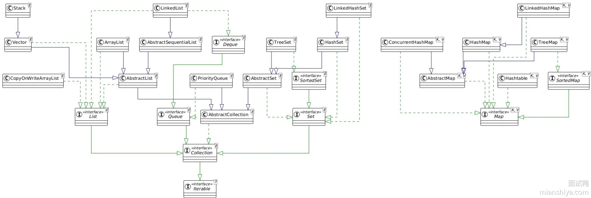
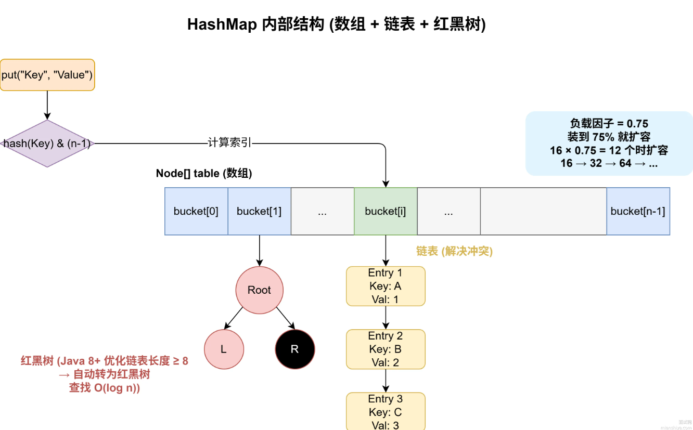

Java 集合框架（Java Collections Framework，JCF）可以理解为：Java 为“批量存储和操作对象”提供的一整套容器体系。

它不仅包括各种集合类，还包括对应的接口、迭代器、排序和算法工具。

主要分为两大类 `Collection` 和 `Map`。

- `Collection` 存单个元素
- `Map` 存键值对

```
Collection
├── List
│   ├── ArrayList
│   ├── LinkedList
│   └── Vector
│
├── Set
│   ├── HashSet
│   ├── LinkedHashSet
│   └── TreeSet
│
└── Queue
    ├── PriorityQueue
    └── Deque

Map
├── HashMap
├── LinkedHashMap
├── TreeMap
├── Hashtable
└── ConcurrentHashMap
```

**为什么需要集合？**

如果只使用数组：

```java
User[] users = new User[10];
```

会有几个问题：长度固定，插入删除不方便，缺少丰富的数据操作能力，无法直接表达 Set、Queue、Map 等数据结构。

而集合：

```java
List<User> users = new ArrayList<>();
```

可以动态扩容，并且提供：

```
add()
remove()
contains()
size()
iterator()
```

等大量通用操作。所以集合框架本质上解决的是如何用统一、标准化的数据结构管理一批对象。


>其中真正需要深入掌握的，其实没有那么多。
>
>第一梯队：
>
>```
>ArrayList
>HashMap
>ConcurrentHashMap
>```
>
>第二梯队：
>
>```
>LinkedList
>HashSet
>TreeMap
>CopyOnWriteArrayList
>```
>
>尤其是 HashMap，建议完整掌握：
>
>```
>HashMap
>│
>├── 数据结构
>│   数组 + 链表 + 红黑树
>│
>├── put()
>│
>├── get()
>│
>├── hash()
>│
>├── 扩容
>│
>├── 链表树化
>│
>├── 为什么容量是 2^n
>│
>├── 为什么负载因子默认 0.75
>│
>├── 为什么线程不安全
>│
>└── JDK 7 与 JDK 8 的区别
>```
>
>最好做到能口述：
>
>> 一个 `put(k, v)` 从调用开始，到数据最终放进 HashMap 的全过程。
>
>这个能力比记零散结论重要很多。




## Collection

`Collection<E>` 表示一组元素。主要有三个子接口：`List`、`Set`、`Queue`。

### List

对比 ArrayList 和 LinkedList 的底层差异，以及在不同业务场景下（如高频读写、并发访问）该如何选型。

ArrayList 的扩容机制

`List` 的特点：有序、可重复、可以通过下标访问。

> 这里的“有序”是指：元素按照插入顺序或指定顺序保存。

例如：

```java
List<String> list = new ArrayList<>();

list.add("A");
list.add("B");
list.add("A");
```

结果 `[A, B, A]`，允许重复。并且：

```java
list.get(0);
```

可以通过索引访问。

常见实现：

```
List
├── ArrayList
├── LinkedList
└── Vector
```

其中最重要的是 `ArrayList`。

#### ArrayList

`ArrayList` 底层核心数据结构是动态数组。

可以简单理解：

```
ArrayList
↓
Object[]
```

例如：

```java
List<Integer> list = new ArrayList<>();
```

内部会使用数组存储元素。

它的特点是：查询快增删慢，线程不安全。

#### LinkedList

底层是双向链表，增删快查询慢，额外指针内存开销大。

每个节点保存：

```
prev
item
next
```

所以它没有数组那种连续存储空间。

注意：

“LinkedList 插入、删除一定比 ArrayList 快”是不准确的。如果你首先要通过下标：

```
list.remove(10000);
```

LinkedList 还要先花 `O(n)` 找到这个节点。所以整体不一定比 ArrayList 快。

实际开发中：大多数 List 场景优先使用 ArrayList，LinkedList 的使用频率明显更低。

#### Vector

是线程安全版的 ArrayList，现在基本不使用了。

### Set

`Set` 的核心特点是：元素不能重复。

例如：

```
Set<String> set = new HashSet<>();

set.add("A");
set.add("B");
set.add("A");
```

最终只有 `A` 和 `B`。

常见实现：

```
Set
├── HashSet
├── LinkedHashSet
└── TreeSet
```

#### HashSet

`HashSet` 是最常用的 Set，底层是基于 HashMap 实现的。

特点：不允许重复、元素无需，查询、插入性能较好，允许 null，线程不安全。

例如：

```
Set<String> set = new HashSet<>();
set.add("A");
```

内部逻辑可以近似理解成：

```
map.put("A", PRESENT);
```

也就是说：

```
HashSet 元素
↓
HashMap 的 Key
```

而 HashMap 的 Key 本身不能重复，所以 HashSet 就自然实现了：

```
元素去重
```

因此：HashSet 的去重机制，本质上依赖 `hashCode()` 和 `equals()`。

这和前面 Object 类中的这两个方法直接关联。

#### LinkedHashSet

`LinkedHashSet` 可以理解成：在 HashSet 基础上用链表维护元素插入顺序。

例如：

```
Set<String> set = new LinkedHashSet<>();

set.add("C");
set.add("A");
set.add("B");
```

遍历时通常 `C A B`，即保持插入顺序。

所以：

```
HashSet
→ 只关注去重

LinkedHashSet
→ 去重 + 保留插入顺序
```

#### TreeSet

`TreeSet` 底层原理基于红黑树，不重复，元素按照大小自动排序，插入/删除/查询通常 O(log n)。

例如：

```
Set<Integer> set = new TreeSet<>();

set.add(5);
set.add(2);
set.add(8);
set.add(1);
```

遍历结果：`1 2 5 8`

排序依据可以来自：

```
Comparable
```

或者：

```
Comparator
```

例如：

```
new TreeSet<>(Comparator.comparing(User::getAge));
```

### Queue

`Queue` 表示队列。

最典型的是 FIFO（First In First Out，先进先出）。

常见操作：

```
offer()
poll()
peek()
```

例如：

```
Queue<String> queue = new LinkedList<>();

queue.offer("A");
queue.offer("B");

queue.poll(); // A
```

常见实现：

```
Queue
├── LinkedList
├── PriorityQueue
└── BlockingQueue 等
```

#### LinkedList


#### PriorityQueue

`PriorityQueue` 底层原理基于堆（Heap）不是简单按插入顺序出队，而是按元素大小出队。

例如：

```java
PriorityQueue<Integer> queue = new PriorityQueue<>();

queue.offer(5);
queue.offer(2);
queue.offer(8);

System.out.println(queue.poll());
```

结果是 `2`，因为默认按照自然顺序。

所以 PriorityQueue 常用于：

```
Top K
优先级任务
最小值 / 最大值快速获取
```


#### Deque

`Deque`：Double Ended Queue，双端队列。

允许：

```
头部插入
头部删除

尾部插入
尾部删除
```

典型实现：ArrayDeque

例如：

```
Deque<Integer> deque = new ArrayDeque<>();

deque.addFirst(1);
deque.addLast(2);
```

可以把它当：

```
队列
或者
栈
```

使用。

现代 Java 中，如果需要栈结构，通常更推荐：

```java
Deque<Integer> stack = new ArrayDeque<>();
```

而不是旧的：

```java
Stack<Integer>
```


#### BlockingQueue


## Map

Map 存储的是 Key-Value 键值对。

例如：

```java
Map<Long, User> map = new HashMap<>();

map.put(1L, user1);
map.put(2L, user2);
```

结构：

```
1 → user1
2 → user2
```

Map 最核心的特点：Key 不能重复。

如果：

```
map.put(1L, user1);
map.put(1L, user2);
```

后面的 value 会覆盖前面的 value。

常见实现：

```
Map
├── HashMap
├── LinkedHashMap
├── TreeMap
├── Hashtable
└── ConcurrentHashMap
```

### HashMap

必须彻底搞懂它的底层结构（数组+链表+红黑树）、扩容机制、哈希冲突解决，以及 JDK 1.8 的优化。

HashMap 是 Java 集合中最重要的数据结构之一，核心目标是根据 Key 的哈希值，尽可能在 O(1) 时间内完成 put 和 get。

JDK 8 以后它的主要结构为：`数组 + 链表 + 红黑树`

整体结构可以理解为：

```
Node[]
│
├── bucket 0
│
├── bucket 1 → Node → Node
│
├── bucket 2
│
└── bucket 3
            ↓
          红黑树
```

其中数组中的每个位置叫一个 bucket（桶）。

#### 核心数据结构

HashMap 内部主要维护一个：

```java
Node<K,V>[] table;
```

Node 可以简化理解成：

```java
static class Node<K,V> {
    final int hash;
    final K key;
    V value;
    Node<K,V> next;
}
```

每个 Node 保存：

```
hash
key
value
next
```

所以如果多个 Key 落到同一个数组位置，就通过 `next` 形成链表。JDK 8 以后，当链表达到一定条件时会转成红黑树。



#### 方法

##### `put` 操作

```java
map.put("Tom", 18);
```

核心流程可以记成：

```
Key
↓
计算 Key 的 hash 值
↓
根据 hash 值用 (table.length-1) & hash 算出应该存放的数组下标
↓
判断桶是否为空？
│
├── 是 → 直接放进去
│
└── 否
     ↓
   Key 是否相同？
     │
     ├── 是 → 覆盖 value
     │
     └── 否
          ↓
        链表 / 红黑树查找
          ↓
        找不到相同 Key
          ↓
        新增节点
          ↓
        判断是否树化
↓
size++
↓
判断是否需要扩容
```

#### 扩容机制

HashMap 有两个很重要的参数：`capacity` 和 `loadFactor`，其中默认负载因子-`loadFactor` 是 0.75。

当数组用了 75% 就会触发自动扩容，阈值计算方式为 `threshold = capacity * loadFactor`。

假设容量是 `16`，那么 `threshold = 16 × 0.75 = 12`，当元素数量超过阈值时，就需要扩容。每次扩容到原来的 2 倍。把数组大小翻倍，然后把所有数据重新算位置放到新数组里，这个操作叫做 rehash，比较耗性能，所以初始化时最好给个预估容量。

### LinkedHashMap

LinkedHashMap 可以理解成：HashMap + 双向链表维护顺序。

因此它可以保证：插入顺序

或者配置成：访问顺序

这也是它可以被用来实现 LRU 缓存的重要原因。

### TreeMap

TreeMap 和 TreeSet 类似，底层主要基于：红黑树。

它的特点：Key 自动排序，查找 / 插入 / 删除通常 O(log n)

例如：

```
Map<Integer, String> map = new TreeMap<>();

map.put(5, "A");
map.put(1, "B");
map.put(3, "C");
```

遍历：`1 3 5`

### Hashtable

Hashtable 是比较早期的 Map 实现。和 HashMap 的一个经典区别：

```
Hashtable
→ 方法大量使用 synchronized
→ 线程安全

HashMap
→ 线程不安全
```

另外：

```
HashMap
→ 可以有 null key、null value

Hashtable
→ 不允许 null key、null value
```

但是现在并发场景通常不会推荐 Hashtable，而使用 ConcurrentHashMap。

### ConcurrentHashMap

其次是 **ConcurrentHashMap** 的线程安全实现原理（CAS + synchronized）。

ConcurrentHashMap 是面向高并发场景设计的线程安全 Map。例如：

```java
ConcurrentHashMap<String, User> map = new ConcurrentHashMap<>();
```

相比 Hashtable（粗粒度同步，并发能力较差），ConcurrentHashMap 更细粒度的并发控制 + CAS + synchronized 等机制，因此并发性能更好。

这一块后面复习 Java 并发时应该重点展开。

## 各集合的有序、排序、重复

“有序”通常指：是否保留某种稳定的遍历顺序，例如插入顺序。

“排序”指：是否按照大小、Comparator 等规则排列。

例如：

| 集合          | 可重复     | 保持插入顺序 | 自动排序 |
| ------------- | ---------- | ------------ | -------- |
| ArrayList     | 是         | 是           | 否       |
| HashSet       | 否         | 否           | 否       |
| LinkedHashSet | 否         | 是           | 否       |
| TreeSet       | 否         | 按排序顺序   | 是       |
| HashMap       | Key 不重复 | 否           | 否       |
| LinkedHashMap | Key 不重复 | 是           | 否       |
| TreeMap       | Key 不重复 | 按排序顺序   | 是       |

所以不要笼统地说 TreeSet 是“有序的”。更准确的是 TreeSet 按比较规则维护排序顺序。

## Collection 与 Collections

这是高频面试题。

`Collection`：java.util.Collection，是集合体系的顶层接口之一。

例如：

```
List
Set
Queue
```

都属于 Collection 体系。而：

```
java.util.Collections
```

是操作集合的工具类。

里面有很多静态方法：

```
Collections.sort(list);
Collections.reverse(list);
Collections.shuffle(list);
Collections.max(list);
Collections.min(list);
```

所以：

```
Collection
→ 接口

Collections
→ 工具类
```

## Iterable 和 Iterator

Collection 又和 Iterable 有关。

整体关系：

```
Iterable
   ↑
Collection
   ↑
List / Set / Queue
```

Iterable 提供：

```
iterator()
```

得到：

```
Iterator
```

例如：

```
Iterator<String> iterator = list.iterator();

while (iterator.hasNext()) {
    String value = iterator.next();
}
```

而：

```
for (String value : list) {
}
```

增强 for 循环底层也和 Iterator 密切相关。

后面还会涉及：

```
fail-fast
ConcurrentModificationException
```

这也是集合的重要面试点。

## 开发中如何选

实际开发可以先这样判断：

```
需要 Key-Value？
│
├── 是 → Map
│       ├── 普通场景 → HashMap
│       ├── 保持插入顺序 → LinkedHashMap
│       ├── Key 排序 → TreeMap
│       └── 并发场景 → ConcurrentHashMap
│
└── 否 → Collection
        │
        ├── 允许重复？
        │
        ├── 是 → List
        │       └── 通常 ArrayList
        │
        └── 否 → Set
                ├── 普通去重 → HashSet
                ├── 保留插入顺序 → LinkedHashSet
                └── 排序 → TreeSet
```

如果需要 FIFO：

```
Queue
```

如果需要优先级：

```
PriorityQueue
```

如果需要栈 / 双端队列：

```
ArrayDeque
```


